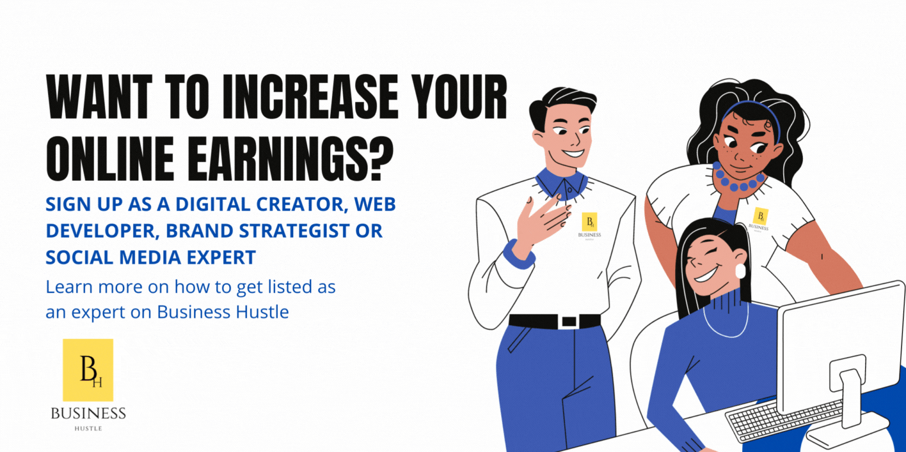

import Bleed from 'nextra-theme-docs/bleed'
import Callout from 'nextra-theme-docs/callout'

<Bleed></Bleed>

# Get the right visibility for your brand

We are a team of professional digital experts and creatives who make it easy for clients, designers and digital nomads to work together. We provide them with the right tools and resources for their brand visibility, so they can make the most of their skills.

Our main objective is to offer comprehensive online and offline digital solutions and strategic guidance to startups, specialized entrepreneurs, fashion brands, SMEs, NGOs, government organizations, and our existing clients. We aim to help them achieve their goals efficiently while suggesting innovative solutions for their benefit.

Our services encompass strategic advice, marketing consulting, content creation, and customized marketing strategy development. We firmly believe in delivering more than just a job well done. We're committed to building trust by keeping our promises, crafting unique designs, and consistently meeting deadlines. Being an independent team allows us to fully dedicate ourselves to every project, ensuring we deliver exactly what you need and more.

We’re committed to helping you grow your business by providing both online and offline digital solutions that are tailored specifically to your needs. In addition to our consulting services, we offer a variety of other services including:

- Strategic advice

- Marketing consulting

- Content creation & marketing strategy development

We believe that our clients deserve more than just a job done. They want to be able to trust their partner will deliver on their promises, create unique designs and deliver on time. Being independent as we are allows us to commit ourselves fully to every project we take on. This means we can give you exactly what you need and nothing less.

Join us and become a valued member of our thriving African community, where talented content creators, designers, and digital nomads come together to innovate and create.

## What we offer 

We offer A to Z solutions in the digital process of marketing & we identify the weaknesses if present in the cycle/process of our clients digital presence as well as ensure successful results are being delivered. As a brand strategist you will receive;

* Content & brand strategy advice by the Company to help you build your online presence and drive revenue.
* Exclusive access to [Startupville](https://www.businesshustle.co.za/Events%20and%20Networking) events Nationwide
* Premium access to the [Business Hustle Management Suite](https://app.businesshustle.co.za)
* Become listed as an [Expert](https://www.businesshustle.co.za/Hire%20an%20Expert) on Business Hustle ©
* eBook copy of [Hustle Basics](https://www.amazon.com/Hustle-Basics-business-Starting-planning-ebook/dp/B07R4NP54V/ref=sr_1_1?crid=37OE7MSJES52M&keywords=hustle+basics+jacob&qid=1658691567&sprefix=hustle+basics+jacob+%2Caps%2C369&sr=8-1) available on Amazon 
* Guidance and group mentorship on digital transformation strategies, web development, GoogleAds & more

## Who is this for?

Weather you're a creative, author, web developer, designer, specialised entrepreneur, or freelancer, we make it easy for you to work online, regardless of weather you run your own business or work for an agency, small business, or enterprise company.

<Bleed></Bleed>

## How does it work?

You can choose to sign up as an Expert for 1, 3 or 6 Months by simply going through the sign up process and submit your details as required. 

| Cost  | Duration |Benefit                                                                     |
| :---- | :----:   | ---:                                                                       |
| **R650** charged once off  | 1 Month | [Get listed](https://flutterwave.com/pay/hv2ini4yfitg?_gl=1%2ar3lgqc%2a_ga%2aNDcwODAzNDk3LjE2NTg2OTQwOTU.%2a_ga_KQ9NSEMFCF%2aMTY1ODcyMTYxOS4yLjEuMTY1ODcyMjA4MS4w) as an expert on Business Hustle & enjoy [member benefits](https://businesshustle-af43.vercel.app/Become%20a%20brand%20strategist#what-we-offer) for **one Month**|
| **R450** charged monthly|3 Months|Sign up for a [3 month membership](https://flutterwave.com/pay/f3gsbd8a0uss) & receive 30% discount plus member benefits listed [above](https://businesshustle-af43.vercel.app/Become%20a%20brand%20strategist#what-we-offer)|
| **R2700** charged every 6 months | 6 Months |Register for a 6 Month membership and receive access to exclusice workshops and networking sessions to guide & assist you on how to use [Business Hustle Resources](https://businesshustle-af43.vercel.app/get-started)                      |

<Bleed></Bleed>

## What do I need?

You can sign up as a Expert from virtually anywhere in the world. Do you have access to or possess the following skills?

- [x] A fast & stable internet connectection
- [x] Own laptop + smartphone
- [x] Relevent digital skills (I.e Graphic design, Content writing, Web development. etc)

## Terms & conditions

Please ensure the following;

* All duties and responsibilities by the Brand Ambassador is compliant with the applicable laws, rules, and regulations of the State agreed upon by Parties
* Your work may not contain defamatory, disparaging or offensive content to any product or business, or be involved in any pornographic or be contrary to any religious beliefs.
* Your delivarables must be original
* Confidentiality is important to us. Therefore you may not disclose to any third party, the use of the works engaged by you and the Company without the other party's written consent. Neither Party may sell, nor disclose with any third party any proprietary or confidential information acquired by them in the course of their engagement with the other, without the written consent of the other party.

