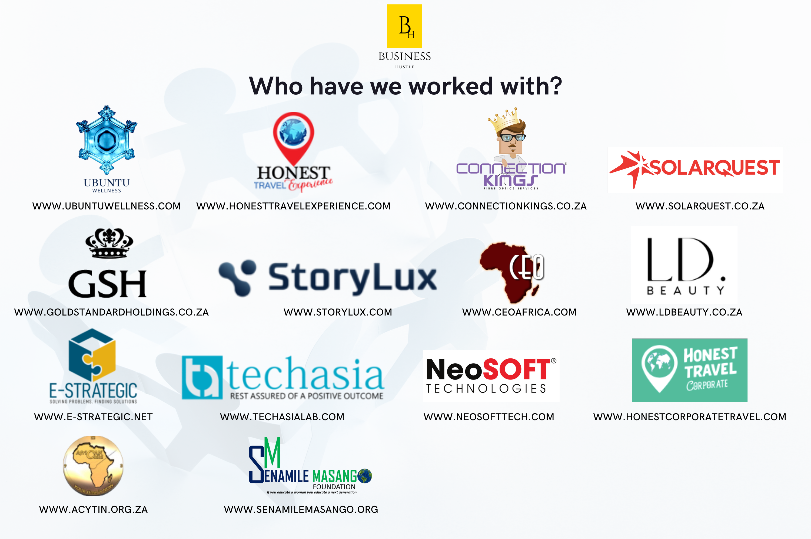
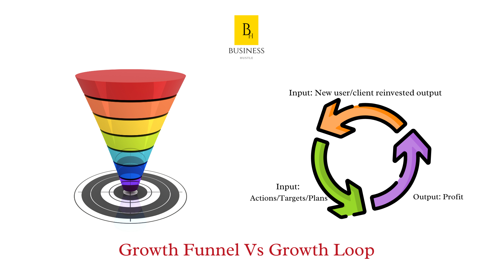
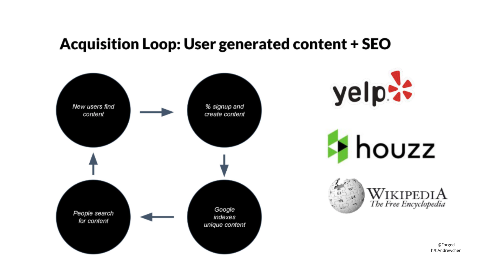
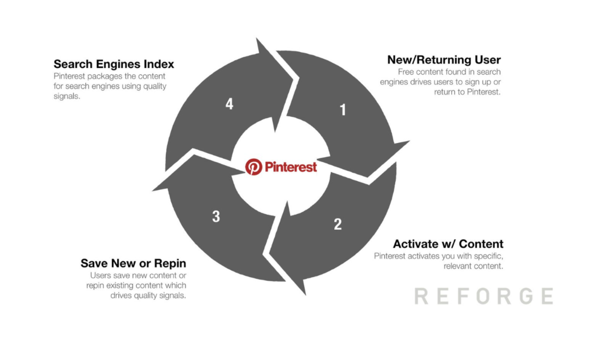
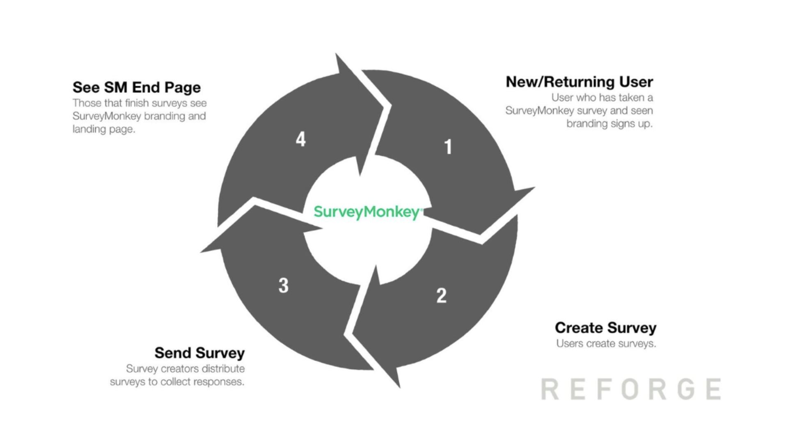
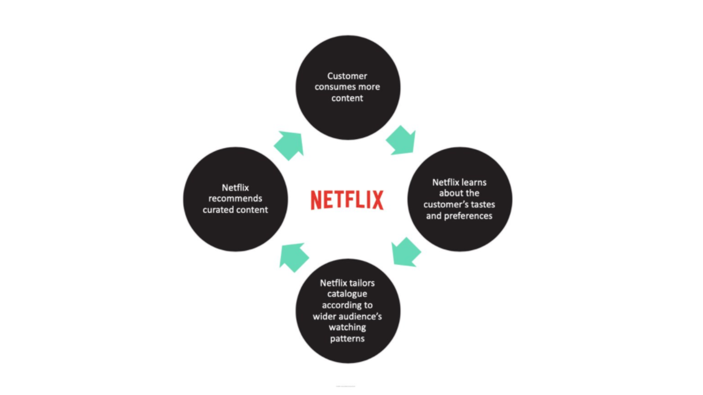
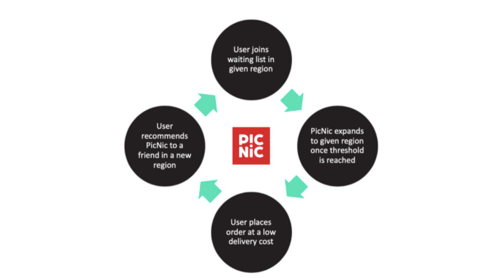

import Bleed from 'nextra-theme-docs/bleed'

<Bleed></Bleed>

<Callout>
  **Have a project you’re working on?** email team@businesshustle or Click here to find out how we can help you grow.
</Callout>

# Entrepreneurship and Business Development

All entrepreneurship starts from solopreneurship, master that and you're on your way. Competency, distribution and marketing all are valuable skills to acquire when starting a business.

Do you find yourself out of budget for branding?. This could possibly mean that it is time to get your leadership to be vocal on social media as a non-negotiable. 

Weather you are using Google Ads, Tiktok, Facebook, YouTube... It doesn't matter.

There are only 2 ways to turn a non profitable campaign into an effective profitable one:

**1. Reduce your cost per conversion**

or 

**2. Increase your revenue per conversion** 

This page offers business learning materiaal and resources to help you understand the concept of Entrepreneurship and Business. Let's dig in:

## How to reduce your cost per conversion:

Increase CTR  by lowering CPCs (w/ CPM model)
- Lower manual bids
- Test bid models: CPC vs target CPA, lowest cost conversion etc.
- Increase CVR
- Block placements, demographics, time of day

## How to increase your revenue per conversion:

- Increase conversion rate
- Increase LTV (revenue per sale or sales per customer)
- Increase referrals (1 paid user => 1.x total users where x > 0)
- Increase virality (ex: paid Twitter ads retweeted = free impressions)

## 3 ways to increase your conversion rate

**1. Target higher intent users**

This is self-explanatory:

* Keywords / negative keywords
* Audiences, demographics, interests
* Placements, devices etc.

**2. Simply improve your ads to increase appeal.**

The right appeal (value prop) makes or breaks any campaign. 

**3. Improve your landing page**

1/ Explain the value you provide (title)
2/ Explain how you'll create it (subtitle)
3/ Let the user visualise it (visual)
4/ Make it believable (social proof)
5/ Make taking the next step easy (CTA)

## Understanding growth cycles 

<Bleed></Bleed>

**So why are loops better than funnels?**. In order to get more out of the bottom...you need to put more in at the top. This means more money.

Where funnels focus on **linear growth.**

Growth loops focus on **compounding growth.** 

## What are loops in business?

**Loops are "closed systems where the inputs through some process generates more of an output that can be reinvested in the input." - Andrew Chen**

1. Viral Acquisition Loops
* User signs up
* Invite or content is sent to friends
* % of friends click the link
* Those users engage with the invite or content
* % of those users sign up

PayPal is another great example of using a viral acquisition loop.

<Bleed></Bleed>

**2. SEO & UGC Acquisition Loops**

1. User searches and finds content
2. % of those ppl sign up and create content
3. Search engines index the top content
4. People search for content
5. They find it
6. % sign up

<Bleed></Bleed>

**3. Pinterest Growth Loop**

* User signs up
* Specific/ Relevant content activates user
* User saves and repins content which gives Pinterest quality signals
* Content -> Search Engines
* User finds content via search engines and either signs up/returns

<Bleed></Bleed>

**4. Survey Monkey Growth Loop**

* New user signs up
* % of users create a survey
* % of users send survey to others
* Survey has a Survey Monkey landing page
* % of surveyee's signup 
* Step one starts again

<Bleed></Bleed>

**5. Netflix Retention Loop**

* Consumer consumes content
* Netflix uses behavioral data to determine preferences
* Netflix curates a catalog relative to watching patterns
* They recommend curated content

<Bleed></Bleed>

**6. PicNic's Market Expansion Loop**

* User joins a waiting list in an area
* Once threshold is met -- they expand in that region
* User places order
* User recommends PicNic to a friend in different area
* % join waiting list

<Bleed></Bleed>

import Callout from 'nextra-theme-docs/callout'

