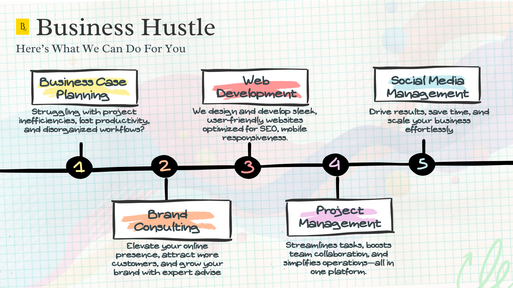

import Bleed from 'nextra-theme-docs/bleed'

<Bleed></Bleed>

<Callout>
  **Have a project you’re working on?** email **team@businesshustle.co.za** or [Click here](https://bit.ly/business-hustle) to find out how we can help you grow.
</Callout>

<Bleed></Bleed>

# Entrepreneurship and Business Development

Your business journey begins here—and trust us, it’s not a straight road. It’s more like a rollercoaster with unexpected twists, gut-wrenching drops, and the occasional victorious scream at the top.

Whether you're a solopreneur sharpening your skills, facing budget constraints for branding or a seasoned entrepreneur tackling the beast of scaling, this is your ultimate guide.

Whether your battlefield is Google Ads, TikTok, Facebook, or YouTube, the rules of engagement are universal: adapt, explore, and evolve.
Here’s the harsh truth: if your campaigns aren’t profitable, you have two choices.

Lower your cost per conversion.
Increase your revenue per conversion.

## Turn Red Campaigns Into Green Profits - Here is how we can help you!

Feeling like your ad campaigns are money pits? Don’t worry—we’ve got your back. Let us help you 
- Increase CTR (click-through rate) by targeting the right audience and tweaking your creative.
- Lower manual bids
- Block irrelevant placements (your ad doesn’t need to run at 3 a.m. in Antarctica).
- Experiment with bidding strategies—sometimes “lowest cost” isn’t the best cost.
- Improve your landing page. Every visitor is a potential client—don’t waste that chance.

## The Ultimate Growth Hack Playbook 

Funnels are so last decade. Let us introduce you to Growth Loops:

<Bleed></Bleed>

<Bleed>
  

    **Loops are closed systems where inputs generate outputs that fuel the inputs. Translation? Exponential, compounding growth. Boom.**

  

</Bleed>

This really is self explanatory — because who wants to keep dumping money at the top just to scrape the bottom?

Here are some iconic examples:

* Viral Acquisition Loop: Think PayPal—invite your friends, get rewards, repeat.

<Bleed></Bleed>

* SEO & UGC Loop: Pinterest nailed this. Create, repin, rank higher, and keep the cycle going.

<Bleed></Bleed>

- Increase conversion rate
- Increase LTV (revenue per sale or sales per customer)
- Increase referrals (1 paid user => 1.x total users where x > 0)
- Increase virality (ex: paid Twitter ads retweeted = free impressions)

## 3 ways to increase your conversion rate

**1. Target higher intent users**

This is self-explanatory:

* Keywords / negative keywords
* Audiences, demographics, interests
* Placements, devices etc.

**2. Simply improve your ads to increase appeal.**

The right appeal (value prop) makes or breaks any campaign. 

**3. Improve your landing page**

1/ Explain the value you provide (title)
2/ Explain how you'll create it (subtitle)
3/ Let the user visualise it (visual)
4/ Make it believable (social proof)
5/ Make taking the next step easy (CTA)

## Understanding growth cycles 

**So why are loops better than funnels?**. In order to get more out of the bottom...you need to put more in at the top. This means more money.

Where funnels focus on **linear growth.**

Growth loops focus on **compounding growth.** 

## What are loops in business?

**Loops are "closed systems where the inputs through some process generates more of an output that can be reinvested in the input." - Andrew Chen**

1. Viral Acquisition Loops
* User signs up
* Invite or content is sent to friends
* % of friends click the link
* Those users engage with the invite or content
* % of those users sign up

PayPal is another great example of using a viral acquisition loop.

**2. SEO & UGC Acquisition Loops**

1. User searches and finds content
2. % of those ppl sign up and create content
3. Search engines index the top content
4. People search for content
5. They find it
6. % sign up

**3. Pinterest Growth Loop**

* User signs up
* Specific/ Relevant content activates user
* User saves and repins content which gives Pinterest quality signals
* Content -> Search Engines
* User finds content via search engines and either signs up/returns

<Bleed></Bleed>

**4. Survey Monkey Growth Loop**

* New user signs up
* % of users create a survey
* % of users send survey to others
* Survey has a Survey Monkey landing page
* % of surveyee's signup 
* Step one starts again

<Bleed></Bleed>

**5. Netflix Retention Loop**

* Consumer consumes content
* Netflix uses behavioral data to determine preferences
* Netflix curates a catalog relative to watching patterns
* They recommend curated content

<Bleed></Bleed>

**6. PicNic's Market Expansion Loop**

* User joins a waiting list in an area
* Once threshold is met -- they expand in that region
* User places order
* User recommends PicNic to a friend in different area
* % join waiting list

<Bleed></Bleed>

import Callout from 'nextra-theme-docs/callout'

