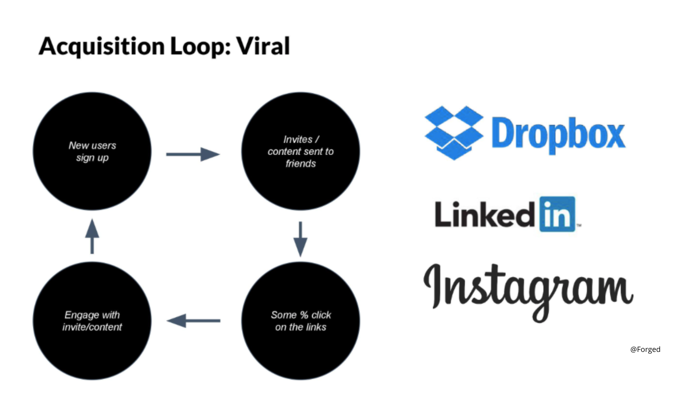

import Bleed from 'nextra-theme-docs/bleed'

<Bleed></Bleed>

<Callout>
 Choose a structured support option based on where your business is right now:

👉 [View Business Development Packages](https://app.businesshustle.co.za/shop/)
</Callout>

# Entrepreneurship and Business Development

Your business journey begins here—and trust us, it’s not a straight road. It’s more like a rollercoaster with unexpected twists, gut-wrenching drops, and the occasional victorious scream at the top.

Whether you're a solopreneur sharpening your skills, facing budget constraints for branding or a seasoned entrepreneur tackling the beast of scaling, this is your ultimate guide.

Whether your battlefield is Google Ads, TikTok, Facebook, or YouTube, the rules of engagement are universal: adapt, explore, and evolve.
Here’s the harsh truth: if your campaigns aren’t profitable, you have two choices.

Lower your cost per conversion.
Increase your revenue per conversion.

## Turn Red Campaigns Into Green Profits - Here is how we can help you!

Feeling like your ad campaigns are money pits? Don’t worry—we’ve got your back. Let us help you 
- Increase CTR (click-through rate) by targeting the right audience and tweaking your creative.
- Lower manual bids
- Block irrelevant placements (your ad doesn’t need to run at 3 a.m. in Antarctica).
- Experiment with bidding strategies—sometimes “lowest cost” isn’t the best cost.
- Improve your landing page. Every visitor is a potential client—don’t waste that chance.

## The Ultimate Growth Hack Playbook 

Funnels are so last decade. Let us introduce you to Growth Loops:

<Bleed></Bleed>

<Bleed>
  

    **Loops are closed systems where inputs generate outputs that fuel the inputs. Translation? Exponential, compounding growth. Boom.💥 **

  

</Bleed>

This really is self explanatory — because who wants to keep dumping money at the top just to scrape the bottom?

Here are some iconic examples:

<Bleed></Bleed>
* Viral Acquisition Loop: Think PayPal—invite your friends, get rewards, repeat.

<Bleed></Bleed> 
* SEO & UGC Loop: Pinterest nailed this. Create, repin, rank higher, and keep the cycle going.
<Bleed></Bleed>

<Bleed></Bleed>

* Retention Loops: Netflix curates content you didn’t know you wanted but now can’t live without.
<Bleed></Bleed>

<Bleed></Bleed>

Join the Commununity and let us know which loop will you build?

import Callout from 'nextra-theme-docs/callout'

