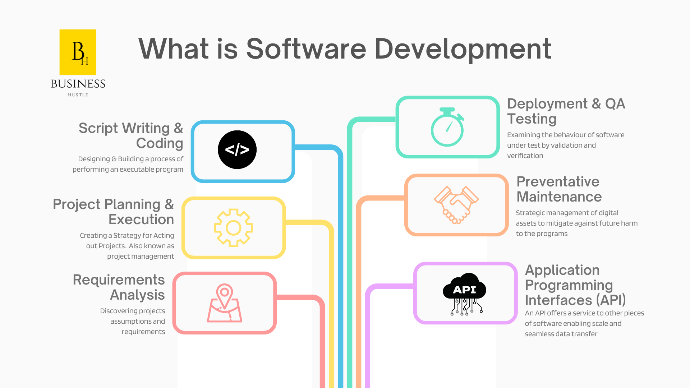

import Bleed from 'nextra-theme-docs/bleed'

# Computer Fundementals 

A computer is a machine that can be instructed to carry out sequences of arithmetic or logical operations automatically via computer programming. Modern computers have the ability to follow generalized sets of operations, called programs. These programs enable computers to perform an extremely wide range of tasks. A "complete" computer including the hardware, the operating system (main software), and peripheral equipment required and used for "full" operation can be referred to as a computer system. This term may as well be used for a group of computers that are connected and work together, in particular a computer network or computer cluster.

A computer is an electronic machine that accepts data, stores and processes data into information. The computer is able to work because there are instructions in its memory directing it.

| Number        | Type             |Specification                                                                                                      |
| :------------ | :---------:      | ----------:                                                                                                      |
| 1.            |Personal Computer | It is a single user computer system having moderately powerful microprocessor                                    |
| 2.            |Workstation       |It is also a single user computer system, similar to personal computer however has a more powerful microprocessor.|
| 3.            |Mini Computer     |It is a multi-user computer system, capable of supporting hundreds of users simultaneously.                       |
| 4.            |Super Computer    |It is an extremely fast computer, which can execute hundreds of millions of instructions per second.             |
 

## Personal Computer 

This is the computer that most people use in their daily lives. This computer is much smaller, less powerful and less expensive than the supercomputer and the mainframe computer. There are two main types of personal computers. Macintosh (Macs) and the PC compatibles (PC). The main differences between the two are the operating systems and the processor they use. This category of computer has two additional types of computers. These are mobile computer and handheld computer. The most popular type of mobile computer is the notebook or laptop computer, and the handheld computer is a very small PC that you can hold in your hand.

## Workstation 

A workstation is a computer used for engineering applications (CAD/CAM), desktop publishing, software development, and other such types of applications which require a moderate amount of computing power and relatively high quality graphics capabilities. Workstations generally come with a large, high-resolution graphics screen, large amount of RAM, inbuilt network support, and a graphical user interface. Most workstations also have mass storage device such as a disk drive, but a special type of workstation, called diskless workstation, comes without a disk drive. Common operating systems for workstations are UNIX and Windows NT. Like PC, workstations are also single-user computers like PC but are typically linked together to form a local-area network, although they can also be used as stand-alone systems.

## Mini Computer

It is a midsize multi-processing system capable of supporting up to 250 users simultaneously.

## Super Computer

Supercomputers are one of the fastest computers currently available. Supercomputers are very expensive and are employed for specialized applications that require immense amount of mathematical calculations (number crunching).
For example, weather forecasting, scientific simulations, (animated) graphics, fluid dynamic calculations, nuclear energy research, electronic design, and analysis of geological data (e.g. in petrochemical prospecting).

To Learn more [Click here.](https://businesshustle-af43.vercel.app/get-started#documentaries)

# Software

 <Bleed></Bleed>
 
Put simply, the computer will not work without software. Software programs are the instructions that tell the computer what to do and how to do it. The two main categories of software are **system software** and **application software.** 

## System software 

The system software also called the operating system (OS) actually runs the computer. This software controls all the operations of the computer and its devices. All computers use system software and without the system software the application software will not work. The most common OS on a PC is the Windows operating system and for the Mac computer it would be the Mac operating system.

## Application software

Application software is a program that allows users to a specific task on the computer. There are a number of different types of application software available to do many of the tasks we do daily. Four examples of common application software and what they are used for are:

| Type             |Example                                                                                                     |
| :---------:                | ----------:                                                                                                      |
|Word Processing Application | One word processing program is Microsoft Word. This program allows you to type letters, assignments and do any other written activity on the computer.|
|Spreadsheet Application     |Microsoft Excel is an example of a spreadsheet program. One can use this program to create charts and do calculations.|
|Email Application           |Outlook Express is an e-mail program that allows you to receive and send e-mails.|
|Internet Application        |Internet Explorer is a program that allows you to get connected to the Internet and look at Web sites like the one you are reading now.|

For a list of software (SaaS, PaaS, IaaS, etc.) and other offerings that have free tiers for you to take advantage of while building content systems for your business. [Click Here.](https://businesshustle-af43.vercel.app/get-started) 
