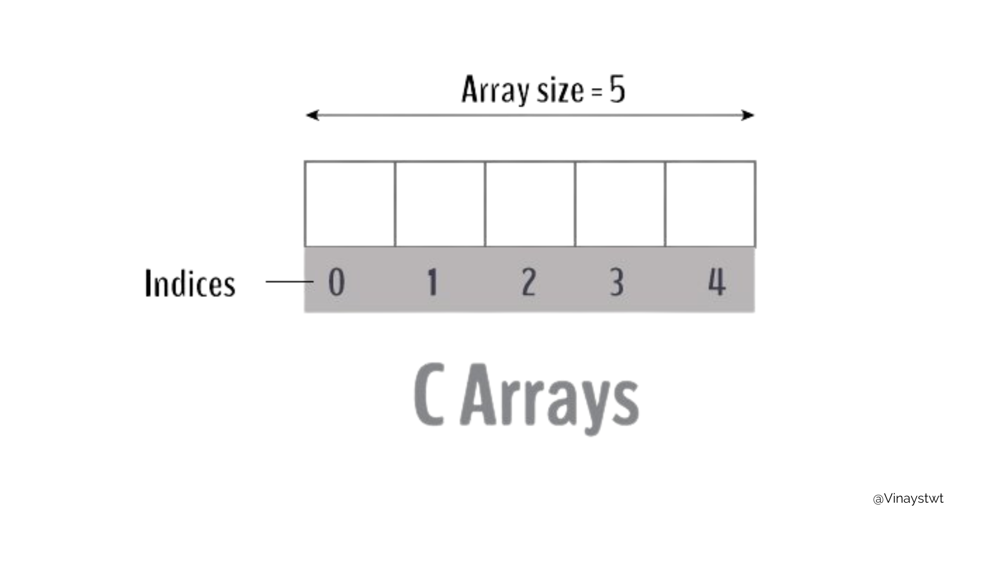
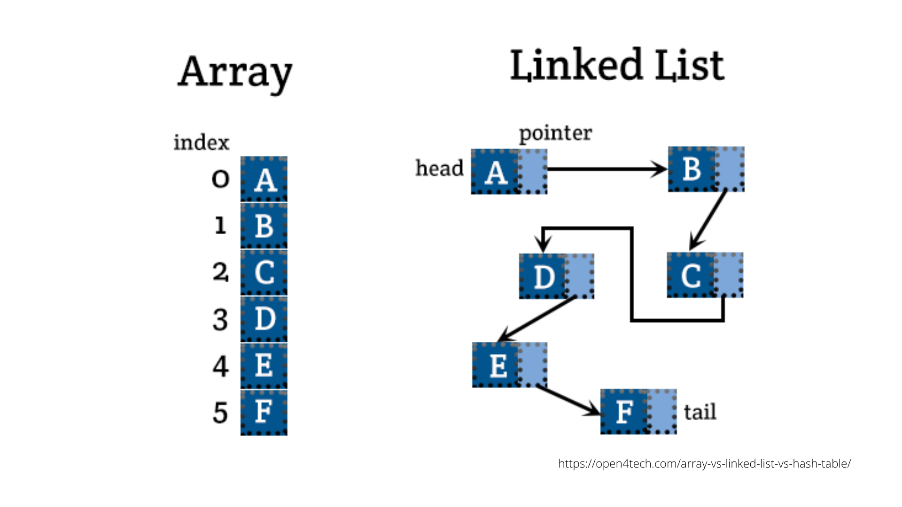
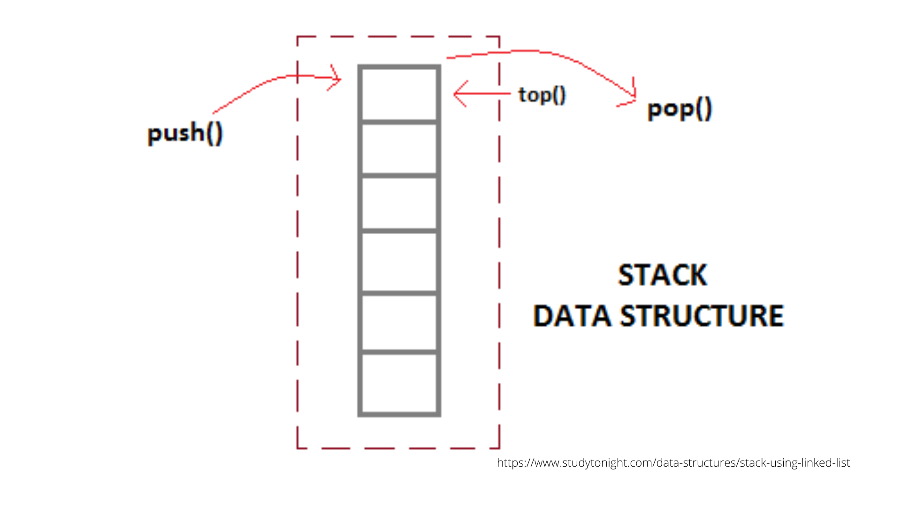
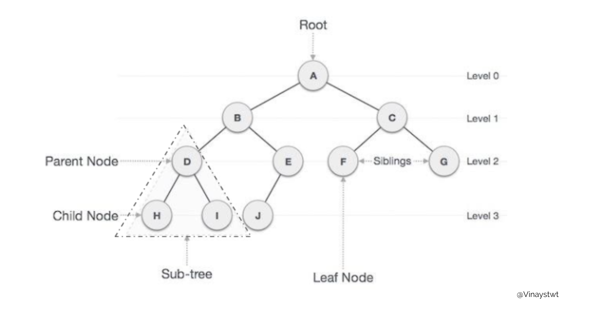
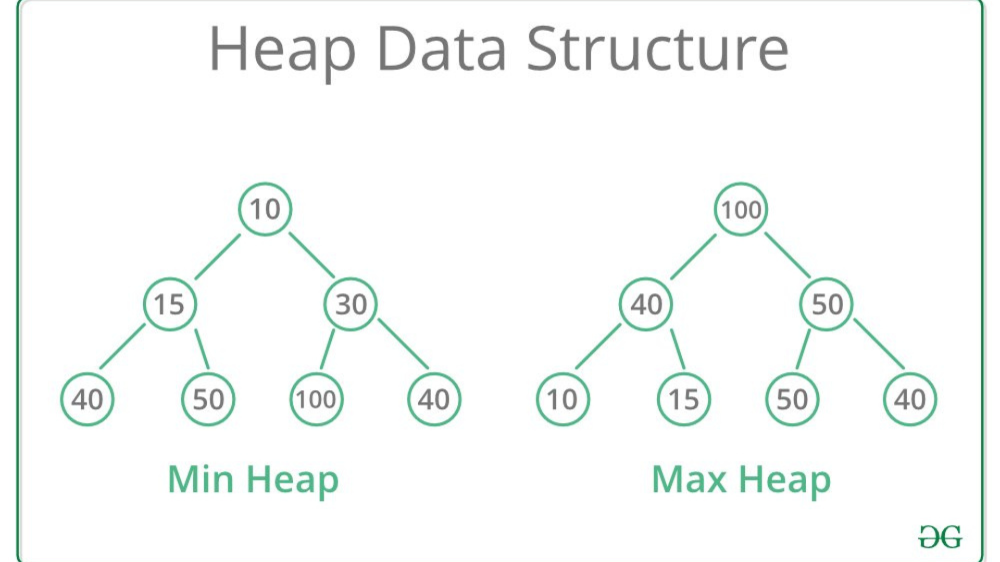

import Bleed from 'nextra-theme-docs/bleed'

# Learning fundementals

Data structures and algorithms are important to understand when dealing with data and are the basics of any programming journey. Weather you are making websites or a complex Machine Learning model, you still need some Data structure knowledge. 

## Array 

An array is a collection of items stored at contiguous memory locations. 

The idea is simply to store multiple items of the same type together. This makes it easier to calculate the position of each element by simply adding an offset to a base value

<Bleed></Bleed>

## Linked list 

A linked list is a linear data structure, in which the elements are not stored at contiguous memory locations, but rather continous links 

<Bleed></Bleed>

## Stack 

A Stack is a linear data structure that follows a particular order in which the operations are performed. 

This is a Last In First Out(LIFO) data structure. It has the following operations :

push: push an element into the stack
pop: remove the last element added
top: returns the element at top of stack

<Bleed></Bleed>

## Queue 

 A Queue is a linear structure that follows a particular order in which the operations are performed. 

The order is First In First Out (FIFO).

## Tree

 A tree is a hierarchical data structure also defined as a collection of nodes. Nodes represent value and nodes are connected by edges. 

The tree has one node called root. The tree originates from this, and hence it does not have any parent.

<Bleed></Bleed>
 
 ## Heap 
 
 A heap is a special Tree-based data structure in which the tree is a complete binary tree. 

Quite often Heaps can be of two types, Max-Heap and Min-Heap

<Bleed></Bleed>

## Youtube e-Learning links

Data Structures and Algorithms, How to master DSA for coding interviews? - https://youtube.com/watch?v=vA4QG1PlTRI

Data Structures Easy to Advanced Course - Full Tutorial from a Google Engineer - https://youtube.com/watch?v=RBSGKlAvoiM

 

