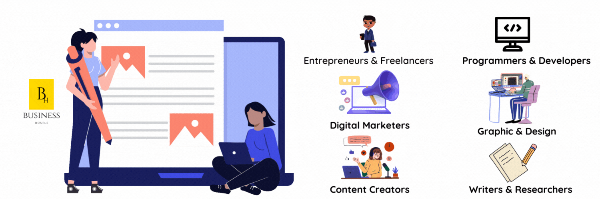

import Bleed from 'nextra-theme-docs/bleed'
import Callout from 'nextra-theme-docs/callout'

## Next Event : November 1, 2024. 

<Bleed></Bleed>

# The Village Economy Indaba Inauguration ©

The Village Economy Indaba is a unique opportunity to bring together innovators, entrepreneurs, community leaders, and change-makers who are passionate about creating sustainable economic growth in Tsitsing. This year, we gather at the Koketso Rakhudu Foundation CET (KOPMAN Old Primary School) in Rustenburg to discuss, strategize, and empower local economies for a brighter future.
 

<Bleed>
  

   ** We don’t believe in limitations or boundaries, just the world as it is, waiting to be changed. **
   
  

</Bleed>

## Who Should Attend?

🌟 Village Entrepreneurs and Small Business Owners

🌟 Community Leaders and Elders

🌟 Development Agencies and NGOs

🌟 Investors and Funding Partners

🌟 Youth Leaders and Aspiring Change-Makers

<Callout>
[Click here](http://app.businesshustle.co.za/product/startupville-event-ticket/) to reserve your spot today to ensure you don’t miss out on this empowering event. Together, we can pave the way for sustainable development, economic resilience, and prosperity in our village communities.
</Callout>

## What is this event about?

Are you interested in delving into the world of startups and business development in a professional and focused setting? Our events are designed to provide a platform for entrepreneurs, authors, creatives, and digital nomads to engage in meaningful conversations about entrepreneurship, business strategies, and online resources.

## Our Mission:

Our primary goal is to facilitate constructive discussions and networking among like-minded individuals. We aim to equip you with valuable insights and resources to enhance your business endeavors. Our events cover pertinent topics, including:

🌟 Branding & Marketing: Learn effective strategies for building and promoting your brand.

🌟 Business Development: Discover innovative approaches to business growth and sustainability.

🌟 Web Development and Cybersecurity: Gain insights into web development and safeguarding your online presence.

🌟 Open-Source Resources: Explore the world of open-source tools and frameworks that can benefit your industry.

🌟 Career Development: Receive guidance for advancing your career and personal growth.

🌟 Wellness and Productivity: Explore ways to maintain well-being and productivity while pursuing your professional goals.

Join our community and embark on a journey of knowledge sharing, professional development, and strategic networking. We invite you to be part of our business-focused events and connect with industry peers.

## Who is the event for?

Whether you're a creative, digital nomad, entrepreneur, writer, researcher, trader, or someone looking to explore alternative avenues for utilizing your skills and expertise to generate income, we invite you to join us. Discover how you can harness the power of knowledge, data, and your unique skills through meaningful interactions with a community of like-minded individuals. Your journey towards new opportunities starts here.

<Bleed></Bleed> 

## How to register

Tickets to the event are available online, you can purchase by clicking on this [link.](http://app.businesshustle.co.za/product/startupville-event-ticket/). Alternatively you may purchase at the door, however the event is capped to **20 Seats Only**, so online registration is crucial to ensure you are on the guestlist.

## Our Host 

[Cape Town Medi-Spa](https://ubuntuwellness.com/) & Ubuntu Wellness offers you an exquisite array of massages, exclusive productivity workshops, and experience cutting-edge healing therapies. Immerse yourself in the realms of cyber and biofeedback technologies, and become a part of the thriving Startupville community where rejuvenation meets innovation. 

<Bleed></Bleed> 

