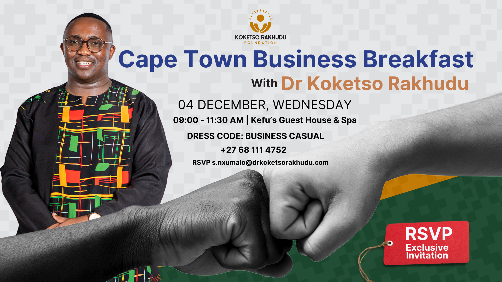
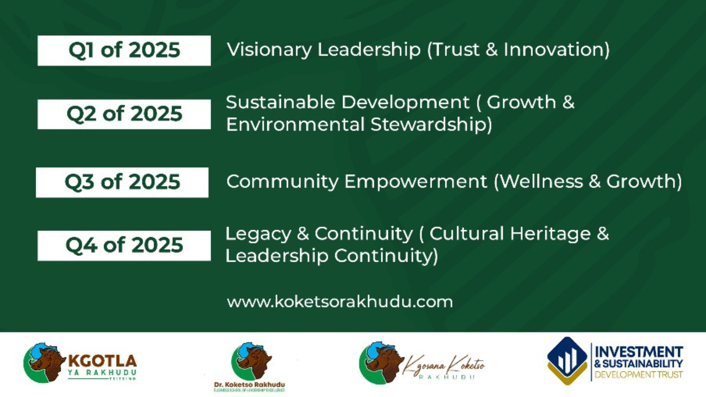

import Bleed from 'nextra-theme-docs/bleed'
import Callout from 'nextra-theme-docs/callout'

## Next Event : December 4, 2024. 

<Bleed></Bleed>

## You’re Invited! A Day to Make a Difference

The [Dr. Rakhudu Foundation](https://www.drkoketsorakhudu.com/calendar) invites you to a Business Breakfast with Dr Koketso Rakhudu on 4th December. Let’s come together to celebrate empowerment and advocate for change. 

📍 Location: Kefu's Guesthouse and Spa
🕒 Time: 9-11:30am

💡 Together, we’ll:

  ✔ Learn from amazing guest speakers

  ✔ Share stories, ideas, and inspiration

  ✔ Drive real impact in our community

Don’t miss this opportunity to connect, grow, and make a difference.

##

# Introducing The Final 2024 Lekgotla Event 

Join us for a powerful gathering that reflects on our journey, celebrates our progress, and sets the stage for an impactful 2025. This Lekgotla is a pivotal moment to unite as a community, align our vision, and launch key initiatives that will drive growth and transformation in the coming year

## Event Details:

Date: November 17, 2024
Location: Tsitsing Community Grounds

Join us for a powerful gathering that reflects on our journey, celebrates our progress, and sets the stage for an impactful 2025. This Lekgotla is a pivotal moment to unite as a community, align our vision, and launch key initiatives that will drive growth and transformation in the coming year.

<Bleed></Bleed>

[Click here](https://tally.so/r/wo0DEb) to become a partner.

Secure your place today and be part of this powerful experience as we look forward to an inspiring 2025.

<Bleed>
  

   ** We don’t believe in limitations or boundaries, just the world as it is, waiting to be changed. **

  

</Bleed>

# The Village Economy Indaba Inauguration ©

<Bleed></Bleed>

[The Village Economy Indaba](https://www.thevillageeconomyindaba.com/) is a unique opportunity to bring together innovators, entrepreneurs, community leaders, and change-makers who are passionate about creating sustainable economic growth in Tsitsing. This year, we gather at the Koketso Rakhudu Foundation CET (KOPMAN Old Primary School) in Rustenburg to discuss, strategize, and empower local economies for a brighter future.

## Who is This For?

🌟 Village Entrepreneurs and Small Business Owners

🌟 Community Leaders and Elders

🌟 Development Agencies and NGOs

🌟 Investors and Funding Partners

🌟 Youth Leaders and Aspiring Change-Makers

<Callout>
[Click here](https://tally.so/r/wLMvJv) to reserve your spot today to ensure you don’t miss out on this empowering event. Together, we can pave the way for sustainable development, economic resilience, and prosperity in our village communities.
</Callout>

## What is this event about?

The Village Economy Indaba is a community-focused event designed to explore and promote economic development within rural and village areas. It aims to bring together stakeholders—such as local entrepreneurs, community leaders, government representatives, investors, and non-profits—to discuss and strategize ways to strengthen village economies.

## How to RSVP

To attend The Village Economy Indaba, please complete the registration process below:

Fill Out the Web Form:
Click on the "Register Now" button to access the registration form. Please provide your details to secure your spot, as spaces are limited.

Submit Your Information:
Once you’ve completed the form, submit it to confirm your interest in attending.

Receive Confirmation:
After submitting, you’ll receive a confirmation email with event details and updates. Be sure to check your inbox to confirm your registration. 

