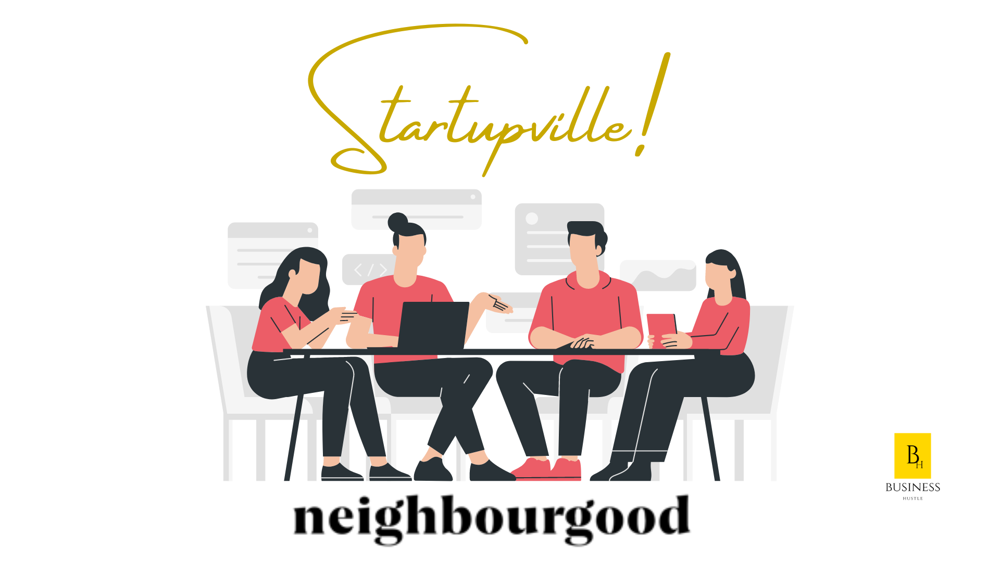

import Bleed from 'nextra-theme-docs/bleed'
import Callout from 'nextra-theme-docs/callout'

## Next Event : 27 July 2022 Neighbourgood Bree

<Bleed></Bleed>

# Startupville ©

Startupville aims to create a safe space for creatives, authors, entrepreneurs etc to share information related to their respective industries while collaborating with likeminded individuals. 

In order to scale your startup you need to understanding that Networking is a huge competitive advantage in the marketplace. Having done so, now you would need to get out of the weeds to work on the business and not in the business.
 
<Callout>
[Click here](https://www.quicket.co.za/events/180502-startupville-space-by-business-hustle-) To learn Register for the next Event.- We would like to thank you for your continued support
</Callout>

## What is this event about?

Building a startup is a game of endurance, resilience and patience. Together we aim to create a safe environment for entrepreneurs, authors, creatives, digital nomads, etc to sit together and have non intrusive conversations about entrepreneurship, the world of business and open-source resources accessible to/for particular industries online. Our goal is to help you network with like minded individuals and power up your business to the next level.

## Who is the event for?

Are you a creative, digital nomad, entrepreneur, writer, researcher, trader or you are employed and interested in alternative ways of possibly using your skill and knowledge to make money?. Come and learn how you can leverage knowledge, data and skill through active engagement with like-minded people.

## How to register

Tickets to the event are available online, you can purchase by clicking on this [link.](https://pay.ozow.io/p/57GGIKf26e). Alternatively you may purchase at the door, however the event is capped to **10 Seats Only**, so online registration is crucial to ensure you are on the guestlist.

## Our Host 

[Neighbourgood](https://neighbourgood.co.za/) is a connected space built for collaboration and productivity.- Thriving neighbourhoods are the lifeblood of our society and our mission is to bring them to life. 

<Bleed></Bleed> 

