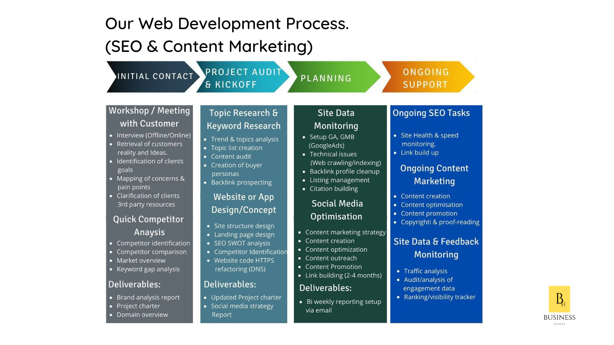

import Bleed from 'nextra-theme-docs/bleed'
import Callout from 'nextra-theme-docs/callout'

<Bleed></Bleed>

# Find the perfect service for your business

We promote brands, engage with customers and build brand preference, most importantly we help increase your sales. Sign up to our [Project Management app](https://bh-projectmanager.bubbleapps.io/?debug_mode=true) to save time and work more efficiently with the team as we work on your project. 

Whether you are B2C, B2B B2B2C, customer relations are the cornerstone of any business

[Click here](https://bit.ly/business-hustle) for a quote and let us help you add a little creative magic to your social media profiles and brand identity through our specialized brand solutions.

<Bleed></Bleed>

## Developers 
<Bleed></Bleed>

### About Steven Silbert 

Steven Silbert accepts commissions on contracts which involve numerical methods and statistical analysis.

Steven has degrees from the University of Cape Town, South Africa in Computer Science and Applied Mathematics and has various certifications from BrainBench.com & Alison.com, global online standards in certification.

Proficiency: 

- [x] PHP  
- [x] SQL
- [x] API Development

### About Tlamelo Oss

Tlamelo Oss is a versatile analytical thinker who enjoys problem solving. He posseses deep technical expertise and is coachable.

Proficiency: 

- [x] Wordpress 
- [x] Canva
- [x] PHP
- [x] Python

## Project Managers & Strategists

<Bleed></Bleed>

Pierre-Axel is a freelance associate project manager, offering assistance in delivering individuals, businesses and NPO's projects successfully. Pierre holds a diploma in business management and is a Certified Associate Project Manager (CAPM). 

Proficiency: 

- [x] Project Management
- [x] Event organising 
- [x] Sales representative 
- [ ] 

## Writers
## GoogleAds Specialist

## UX/UI Designers

## Freelancers

## Social Media Managers

## Photographers

## Voice over artists

## Sales Experts

## Digital Marketing Expert

## Operation Managers

