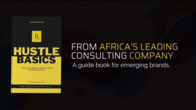

import Bleed from 'nextra-theme-docs/bleed'

# Real Projects. Real Work. Real Outcomes.

Business Hustle is not a theory-driven consultancy - we are a delivery-first business developmement partner. Over the years, we've worked across wellness, technology, creative industries, NPOs, and small businesses to help founders turn ideas into structured, operational, and revenue-capable ventures.

Below is a curated showcase of projects, platforms, and initiatives developed or supported by Business Hustle. 

 
# Hustle Basics A Quick Guide to Business

<Bleed></Bleed>

<Bleed>
  

    **This book is meant to guide the entrepreneur through dynamic complex business situations experienced during the start-up phase of your organization.**

  

</Bleed>

Hustle Basics — Start Smart, Hustle Strong
Hustle Basics is the essential entry-level toolkit for entrepreneurs, freelancers, and small business owners. Designed to turn overwhelm into clarity, ideas into action, and uncertainty into momentum — simply, effectively, and affordably.

**This is for you if you’re:**

Launching your first business or side hustle

Feeling stuck or unsure about your next move

Seeking a clear foundation before investing further

**What’s included:**

✅ Clarity Frameworks – Define your vision, purpose, and direction

✅ Foundational Planning Tools – Map out your path from idea to execution

✅ Essential Strategy & Systems – Build a solid base to scale confidently

✅ Action-Oriented Resources – Self-paced, practical, and designed to deliver results

📌 Where successful hustles begin.
Start building the right way — with structure, clarity, and momentum.

