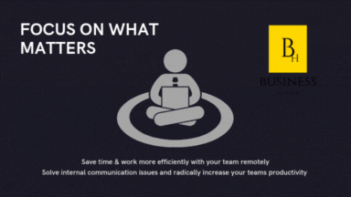

import Bleed from 'nextra-theme-docs/bleed'

# Real Projects. Real Work. Real Outcomes.

Business Hustle is not a theory-driven consultancy - we are a delivery-first business developmement partner. Over the years, we've worked across wellness, technology, creative industries, NPOs, and small businesses to help founders turn ideas into structured, operational, and revenue-capable ventures.

Below is a curated showcase of projects, platforms, and initiatives developed or supported by Business Hustle. 

 
# Hustle Basics A Quick Guide to Business

<Bleed></Bleed>

<Bleed>
  

    **This book is meant to guide the entrepreneur through dynamic complex business situations experienced during the start-up phase of your organization.**

  

</Bleed>

[Hustle Basics](https://app.businesshustle.co.za/product/hustle-basics-ebook/) — Hustle Basics is the essential entry-level toolkit for entrepreneurs, freelancers, and small business owners. Designed to turn overwhelm into clarity, ideas into action, and uncertainty into momentum — simply, effectively, and affordably.

**This is for you if you’re:**

Launching your first business or side hustle

Feeling stuck or unsure about your next move

Seeking a clear foundation before investing further

**What’s included:**

✅ Clarity Frameworks – Define your vision, purpose, and direction

✅ Foundational Planning Tools – Map out your path from idea to execution

✅ Essential Strategy & Systems – Build a solid base to scale confidently

✅ Action-Oriented Resources – Self-paced, practical, and designed to deliver results

📌 Where successful hustles begin. 
Start building the right way — with structure, clarity, and momentum.

## Business Systems & Platforms

### Business Hustle Project Manager
<Bleed></Bleed>

At the core of Business Hustle is our project management and execution platform — the system we use to plan, track, and deliver real business work.

This is not generic project management software.
It is a business execution system built around how entrepreneurs and small teams actually operate.

**The platform helps you:**

Structure your business initiatives into clear projects

Break strategy into actionable tasks

Track progress across teams and collaborators

Maintain accountability and momentum

Move from planning to execution — consistently

Whether you’re building a startup, running a programme, or managing multiple initiatives, this PM tool provides clarity and control. [Access Business Hustle Project Management App](https://app.businesshustle.co.za/product/ultimate-project-management-solution/)

### HustlePortal™
<Bleed></Bleed>
[Launch Your Business Online — Fast, Affordable, Professional](https://hustleportal.online/business-hustle)

HustlePortal is Business Hustle’s entry-level digital launch solution — built specifically for entrepreneurs, startups, and small businesses in South Africa who need a credible online presence without breaking the bank.

For only R1,850/year, you get a professionally designed, SEO-ready landing page that turns visitors into enquiries and customers.

