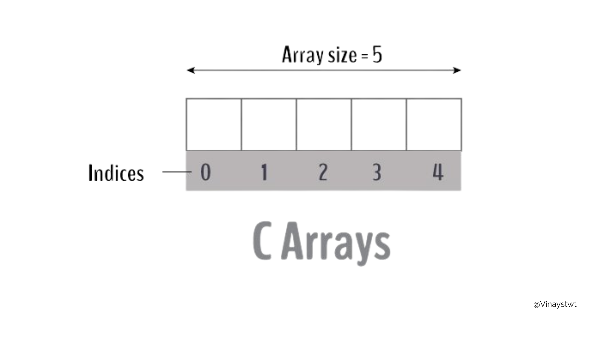
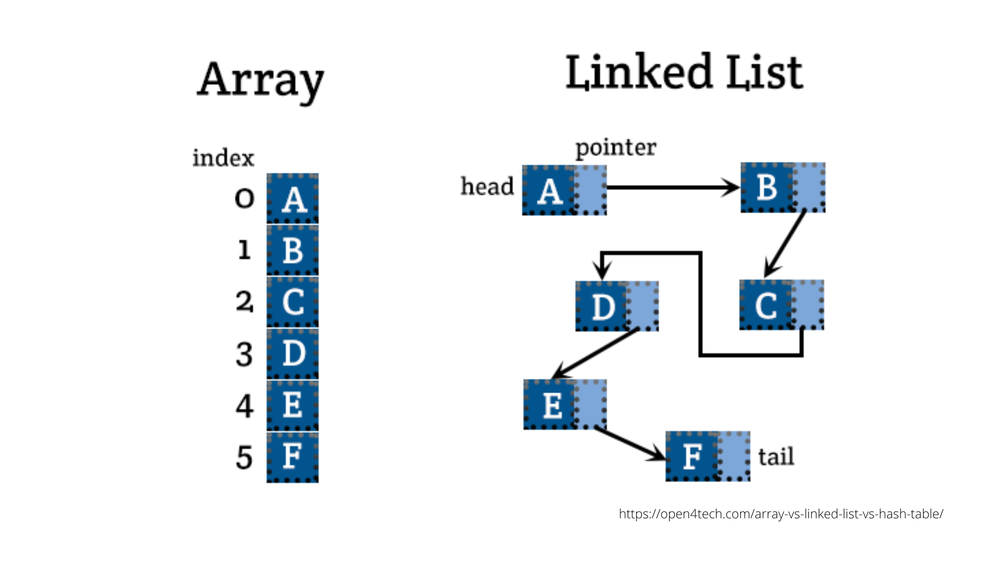
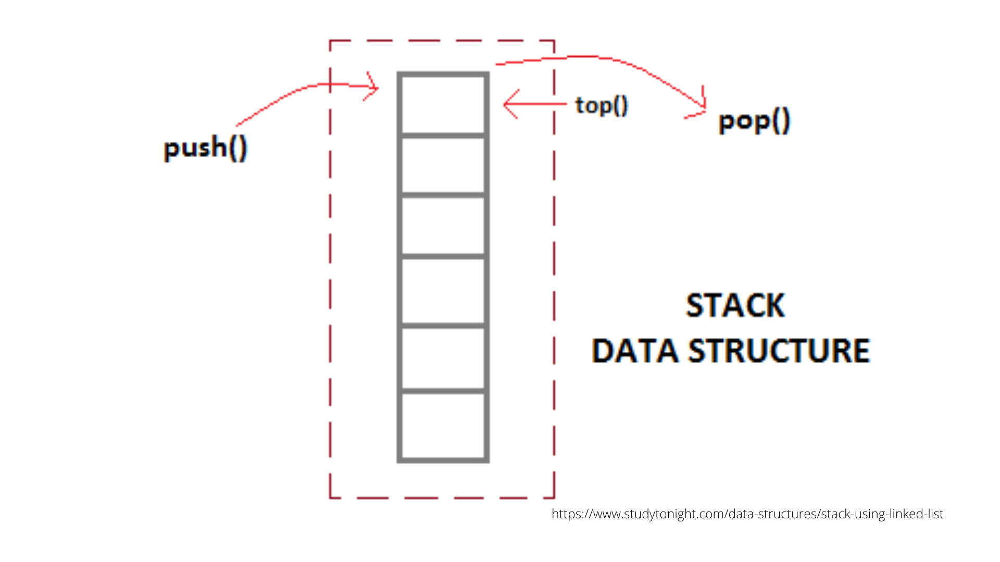
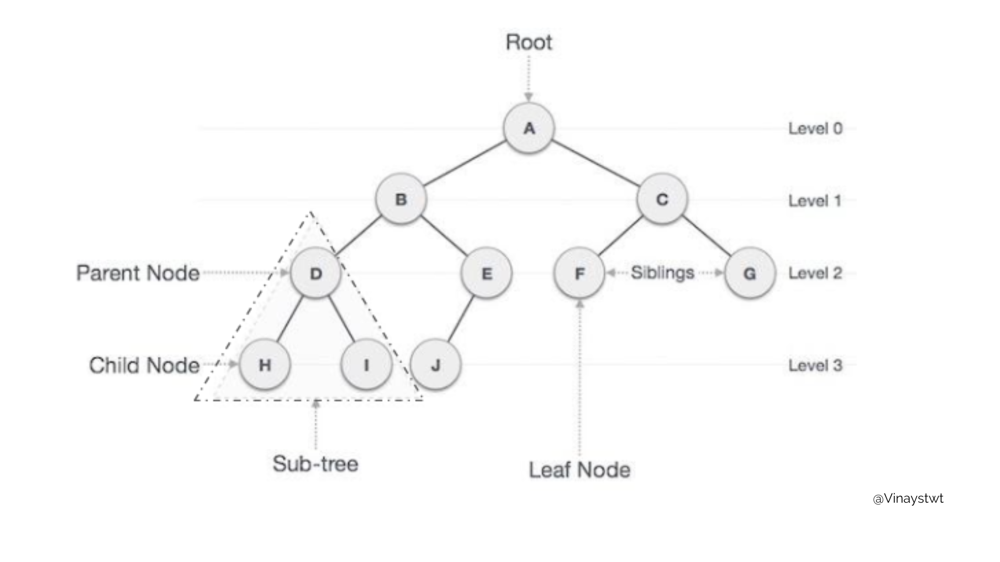
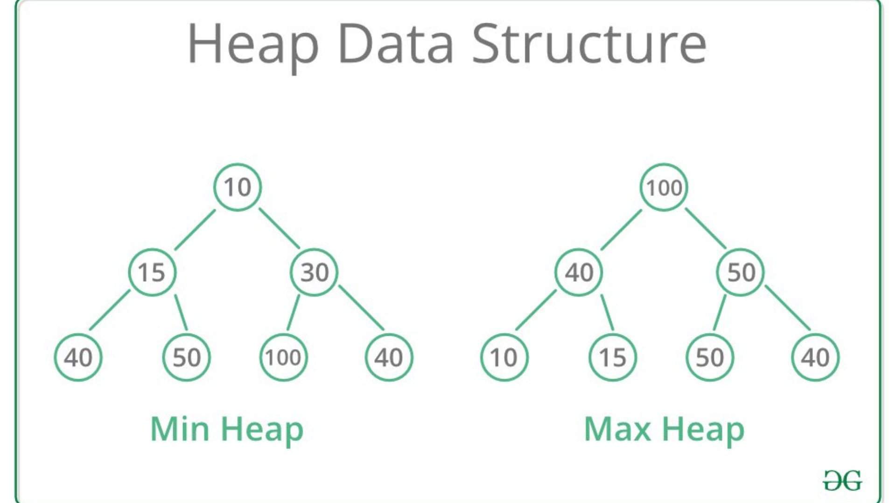

import Bleed from 'nextra-theme-docs/bleed'
import Callout from 'nextra-theme-docs/callout'

# Resources

<Bleed></Bleed>

## What is this? 

<Bleed>
  

    **As a business owner, you know that the more online presence you have, the better.**

That's why we've curated a list of the best tools out there so that you can find what you need quickly.

  

</Bleed>
 
Welcome to Your Hub of Free Resources!

Unlock the tools you need to take your business to the next level—all for free! Here’s what you’ll gain:

**Cost Savings:** Access high-quality software with free tiers, letting you test and grow without financial risk.
 
**Enhanced Efficiency:** Streamline your systems and simplify your workflows to save time and energy.

**Creative Boost:** Find innovative tools to bring your ideas to life and tackle special projects with ease.

**Flexibility:** Experiment with different options to discover the perfect fit for your needs, all at no cost.
Why wait? Dive in today and start building smarter, faster, and more creatively. Your success story starts here—happy exploring!

Read our terms and conditions [here.](https://businesshustle-af43.vercel.app/Our%20Story/Terms%20and%20Conditions)

<Callout>
[`Click here`](https://app.businesshustle.co.za/) Boost Your Productivity, One Click at a Time. Try it Now!
 
</Callout> 

## Design & UI

If you're a UI designer or just playing around to see what you can create these links are important to know:

[Canva](https://www.canva.com) - 8,000+ free templates and thousands of free photos. 

[Figma](https://www.figma.com) - Generate, edit and publish beautiful websites and landing pages for your startup. The Free tier allow you to have one website, fully customizable and published on the web. 

[Pixels](https://www.pexels.com) - Free stock photos for commercial use. This has a free API that allows you to search photos by keywords. 

[Cool Backgrounds](https://coolbackgrounds.io) - Gain access to a collection of tools to create compelling, colorful images for blogs, social media, and websites. 

[RemoveBG](https://www.remove.bg/) - Remove image bckgrounds. 

[Humaaans](https://www.humaaans.com/) - Library of editable people illustrations. Free for both commercial and personal use. 

[Cartoon Pho](https://cartoon.pho.to) - Turn your photos into cartoons for your website or presentations. 

[Colorhunt](https://colorhunt.co) - Color Hunt is an open platform for color inspiration with thousands of trendy hand-picked color palettes. 

[Palette Ninja](https://palette.ninja) - Design harmonious color schemes in seconds with Palette Ninja. 

[Stripes Generator](https://stripesgenerator.com) - Stripes generator for your website. 

[Photopea](https://www.photopea.com) - A Free, Advanced online design editor with Adobe Photoshop UI supporting PSD, XCF & Sketch formats (Adobe Photoshop, Gimp and Sketch App). 

[Get Waves](https://getwaves.io) - An SVG wave generator to make unique SVG waves for web design. 

[IconMonstr](https://iconmonstr.com) - Black and white themed minimal icons with customizeable thickness. 

[Undraw](https://undraw.co) - "MIT licensed illustrations for every project you can imagine and create. 

[Unscreen](https://www.unscreen.com/) - Remove Video Background 100% Automatically. 

[Gratisography](https://www.gratisography.com) - Photographer Ryan McGuire provides this collection of high-resolution pictures for free. You can use them on your personal or commercial project free of copyright restrictions. 

[The Noun Project](https://thenounproject.com) - Search for a noun and find an icon as simple as that. 

[UI Design Daily](https://uidesigndaily.com/) - Fantastic UI Components of all types.

[Paaatterns](https://products.ls.graphics/paaatterns/) - Free collection of gorgeous patterns for all vector formats 

[Absurd Design](https://absurd.design/) - Free surrealist illustrations for designers and developers. 

[Blush](https://blush.design/) - Free customizable illustrations with Figma Plugin. 

[Pixeltrue](hhttps://www.pixeltrue.com/illustrations) - Free animated illustrations. 

[Sketch Valley](https://sketchvalley.com) - Download free PNG, SVG or AI file. 

[Smart upscaler](https://icons8.com/upscaler) - Upscale images by 2-4x resolution. 

[Pattern Monster](https://pattern.monster) - A simple online pattern generator to create repeatable SVG patterns. Speed up your website without compromising on image quality. Perfect for website backgrounds, apparel, branding, packaging design and more. 

[Dimensions](https://www.dimensions.com/) - Dimensions.com is an ongoing reference database of dimensioned drawings documenting the standard measurements and sizes of the everyday objects and spaces. 

## Web Design Inspirations  

A Curated Collection of Outstanding Website Design Inspirations
Whether you’re crafting your next website or refining an existing one, these resources will ignite your creativity and provide the inspiration you need:

[Awwwards](https://www.awwwards.com) - Showcasing the pinnacle of design, creativity, and innovation online. Awwwards features and rates the best websites globally, offering endless inspiration for UI/UX enthusiasts.  
 
[SaasLandingPage](https://saaslandingpage.com) - Explore over 600 exceptional landing page examples from leading SaaS companies. A treasure trove of ideas for your next design project. 

[Behance](https://www.behance.net/) - A dynamic platform featuring creative design projects from artists worldwide. Browse projects by style, creator, or industry. 

[Design Vault](https://designvault.io/) - Dive into a rich library of screenshots and design patterns from real-world digital products, perfect for sparking fresh ideas. 

## Email

Top Email Marketing Tools to Boost Your Campaigns
Streamline your email marketing efforts with these versatile and user-friendly tools:

[buttondown](https://buttondown.email) - A simple yet powerful newsletter service. Perfect for creators and marketers, offering up to 1,000 subscribers completely free. 

[forwardemail](https://forwardemail.net/en) - Effortless email forwarding for custom domains. Create and forward unlimited email addresses tied to your domain name at no cost. 

[sparkpost](https://www.sparkpost.com) - Get started with robust email delivery features, including the first 500 emails per month free—ideal for small-scale campaigns. 

## Website hosting 

Free hosting solutions to kickstart your website with ease:

[netlify](https://www.netlify.com) - A seamless, Git-based serverless platform for modern web development.   

[sparkpost](https://www.sparkpost.com) - Free Unlimited Web Hosting Service for PHP, MySQL no ads include. 

[000webhost](https://www.000webhost.com) - Cost-free hosting with Apache, PHP, MySQL, and cPanel, though ads are displayed at the bottom of each page.  

[toolspingdom](https://tools.pingdom.com/#5e931005ed400000) - Performance monitoring and cost analysis tools to optimize your website.   

## Downloadable Design Software 

Enhance your creative projects with these free tools for UI design, photo editing, 3D modeling, and more:

[Gimp](https://www.gimp.org/) - A powerful, open-source image editor with features comparable to Photoshop. 

[Gravit Designer](https://www.designer.io/en/) - A cross-platform vector graphic design application packed with features. 

[Be Funky](https://www.befunky.com/features/graphic-designer/) - An online graphic design platform offering easy-to-use editing tools.   

[Krita](https://krita.org/en/download/krita-desktop/) - A robust sketching and painting program designed for digital artists.  

[GUI Prototyping](https://pencil.evolus.vn) - Software for creating interactive GUI prototypes for web and app design. 

[Color Picker](https://colorpicker.fr) -Open-source color software for retrieving, manipulating, and organizing colors. 

## Search Engine Optimisation 

Boost your website's visibility and rankings with these effective SEO tools:

Effective SEO tools for your business. SEO is an essential factor when it comes to marketing SaaS products, or making the website more visible on web browsers.

[seositecheck](https://seositecheckup.com) - Audit your site for proper tags and errors to enhance SEO.  

[webpagetest](http://webpagetest.org) - Run comprehensive audits with recommendations for optimizing your site's performance globally.   

[Backlinko](https://backlinko.com/) - Access exclusive SEO strategies shared through email tips. 

[Search Engine Land](https://searchengineland.com/) - Detailed guides, including tips on setting up Performance Max campaigns effectively.

[Moz](https://moz.com/) - Industry-leading SEO software for improving traffic, rankings, and site visibility. 

[Search engine watch](https://www.searchenginewatch.com/) - The ultimate SEO newsletter & resources 

[Search engine journal](https://www.searchenginejournal.com/) - SGet expert insights and guides on SEO forecasting and strategies. 

[SEO Roundtable](https://www.seroundtable.com/) - SEO discussions and topics on different Search engine marketing strategies 

[Learning SEO](https://learningseo.io/) - A roadmap filled with free guides, tools, and resources to master SEO. 

<blockquote class="twitter-tweet">
Best SEO Tips for Start-Ups <a href="https://t.co/MdsWN4dImj">https://t.co/MdsWN4dImj</a> <a href="https://twitter.com/hashtag/seoforstartup?src=hash&amp;ref_src=twsrc%5Etfw">#seoforstartup</a>
&mdash; Business Partner Mag (@BizPartnerMag) <a href="https://twitter.com/BizPartnerMag/status/1548719180836478976?ref_src=twsrc%5Etfw">July 17, 2022</a></blockquote> 

## Content  creation 

Writing compelling content can unlock incredible earning potential—reaching $1M+/year—no matter where you are in the world. These resources will help you refine your skills and enhance your creative toolkit:

[ghostwriterai](https://virtualghostwriter.com) - A virtual AI-powered content writer that helps craft engaging copy efficiently.   

[mockuper](https://mockuper.net) - Quickly design professional mockups for your products with this free online generator.

[googlefonts](https://fonts.google.com) - Access an extensive library of free, easy-to-implement fonts for your website or projects.  

[videoinu](https://videoinu.com) - An intuitive platform for creating and editing screen recordings or other videos online. 

[wireframe](https://wireframe.cc/) - A minimalist tool for sketching layouts and brainstorming design ideas. Ideal for quick prototyping. 

## Forms

Forms are vital in creating user-friendly interfaces and gathering actionable feedback from your audience. These tools make form design simple and effective:

[99inbound](https://www.99inbound.com) - Build custom forms and share them online. Receive email or Slack notifications for submissions. The free plan supports 2 forms, 100 entries per month, and basic email/Slack integrations.   

[webforms](https://web3forms.com) - Create contact forms for static and JAMstack websites without needing backend code. The free plan includes unlimited forms, domains, and up to 250 submissions per month.  

## Software Development 

Lower software development overheads by making use of the following free/paid tools. You don't need to have a technical background to get started to work with software development

[Developer Roadmaps](https://roadmap.sh/) -  a community effort to create roadmaps, guides and other educational content to help guide the developers in picking up the path and guide their learnings.  

[anvilworks](https://anvil.works) - Full stack web apps with nothing but Python.  

[encore](https://encore.dev) - Get a smoother backend workflow, from idea to production. Encore uses source code analysis to radically simplify your development experience.   

[gearhost](https://www.gearhost.com/pricing) - A Platform for .NET and PHP apps. You will receive 256 MB of RAM for free on a shared server with limited resources.   

[m30](https://m3o.com) - Ship backend for your frontend without managing the infrastructure for free.  

[appfleet](https://appfleet.com) - appfleet is an edge platform that allows its users to deploy containers globally to multiple regions at the same time. With a simple to use UI while automating all the complexity such as smart routing, clustering, failover, monitoring etc. Appfleet is free for open source projects and all users automatically get $10 to host whatever they want.   

[docsapp](https://www.docsapp.io) - Easiest way to deploy and publish documentation. Completely free for Open Source.  

[QR Code Generator](https://markodenic.com/tools/qr-code-generator/) - Use this tool to easily create a QR code for your project. 

[Shields](https://shields.io/) - Create badges with your own customization. 

[Over API](https://overapi.com/) - A collection of all software development cheat codes. 

[DevDocs](https://devdocs.io/) - This tool combines multiple API documentations in a fast, organized, and searchable interface. 

[Octopus](https://octopus.do/) - Sitemap builder tool.  

[Clickminded](https://www.clickminded.com/button-generator/) - A call to action button creator. 

[HaveIbeenPwned](https://haveibeenpwned.com) - Check to see if your email or phone is in a data breach. 

## Education & Training

Choose from a broad selection of online courses to help you and your company grow.

[edx](https://www.edx.org/) - A series of University-level courses from Harvard, MIT, Wharton, and more. 

[learnuui](https://learnui.design/index.html) - Learn UI design for free. 

>Download [Hustle Basics](https://gumroad.com/l/opbDH) by    today and find out how to tap into an unlimited amount of internet resources for you and your business

[Kopywriting](https://kopywritingkourse.com/free-copywriting-course/) - Free course on copywriting. 

[Youtube](https://www.youtube.com/watch?v=IqmrNUoiy7g&feature=youtu.be) - A lesson in Supply chain management by Steve Miles and John Williams, MIT. 

[Techstars](https://toolkit.techstars.com/master-your-pitch) - Master your pitch and improve your communication skills. 

[Frontend Mentor](https://www.frontendmentor.io/) - Practice your coding skills using real-world UI Challenges using HTML, CSS and Javascript. 

## Practice SQL 

Quick and easy to use SQL environment for running and experimenting code.

[SQLZOO](https://sqlzoo.net/wiki/SQL_Tutorial) - Learn & practice SQL in stages 

[W3Schools](https://www.w3schools.com/sql/default.asp) - Learn to code for free 

[SQLize](https://sqlize.online) - A free online SQL environment for quickly running, experimenting with and sharing code. You can run your SQL code on top of the most popular RDBMS including MySQL, MariaDB, SQLite, PostgreSQL and Microsoft SQL Server 2017.   

[SQLTest](https://www.sqltest.org) - An easy-to-use tool to generate real-world workload for testing. It can be used on-premises as well as in the cloud. 

[SQLBolt](https://sqlbolt.com) - Welcome to SQLBolt, a series of interactive lessons and exercises designed to help you quickly learn SQL right in your browser. 

## Payment Integrations 

See challenges in a new light with accurate Project Management. and Custom decision support with our free resources. 

[Fraudlabspro.](https://www.fraudlabspro.com/) - Help merchants to prevent payment fraud and chargebacks. Free Micro Plan available with 500 queries/month.  

[Revenuecat.](https://www.revenuecat.com/) - Hosted backend for in-app purchases and subscriptions (iOS and Android). Free up to $10k/mo in tracked revenue.  

[Currencystack.](https://currencystack.io/) - Production-ready real-time exchange rates for 154 currencies.  

[Exchangerate_api.](https://www.exchangerate-api.com/) - An easy to use currency conversion JSON API. Free tier with no request limit. 

[Mailpop.](https://mailpop.in/) - Get the most of your Stripe notifications with contextualized information.  

[Getbricksapp.](https://free.getbricks.app/) - A note-taking app (PWA) with a powerful built-in multiline calculator.  

## Seminar, research writing, talks, etc

Seminars and lectures focused on teaching you how to build profitable business and various business and execution strategies.

[Advice on Research and Writing](http://www.cs.cmu.edu/~mleone/how-to.html) - A collection of advice about how to do research and how to communicate effectively (primarily for computer scientists).

[PHD MS Articles](http://www.cse.iitd.ac.in/~srsarangi/articles.html) - articles and views

[Seminar and reports](https://www.cse.iitb.ac.in/~ranade/communicationskills.html) - Everyone must read this tiny book before writing the seminar report

[Latex reference](http://latex.knobs-dials.com) - Arbitrary reference

## Project Management 

Project management is all about transforming your service delivery in order to drive broad adoption and create sustainable value – Excellence in business is what we at Business Hustle strive for you to achieve.

[Business Hustle Project Management Solution](https://app.businesshustle.co.za/product/ultimate-project-management-solution/) - Streamline the way you manage projects with our Ultimate Project Management Solution Today. 

[Bitwarden.](https://bitwarden.com/) - Among the easiest and safest way for individuals, teams, and business organizations to store, share, and sync sensitive data.  

[Cally.com](https://cally.com/) - With cally.com, you can quickly and easily find a suitable date and location for your group event.  

[Flowdock](https://www.flowdock.com) - Flowdock brings all of your conversations, work items and tools into one place. Prioritize work, solve problems, search and organize across teams, locations and timezones.  

[Miro](https://miro.com/) - The online collaborative whiteboard platform to bring teams together, anytime, anywhere.  

[Nuclino](https://www.nuclino.com/) - One central place for all your team's work.  

[Pendulums](https://pendulums.io/) - Manage and track your time more efficiently using a modern time tracking tool.Pendulums is a free time tracking tool which helps you to manage your time in a better manner with an easy to use interface and useful statistics.  

[StatusPile](https://www.statuspile.com/) - A status page of status pages. Track the status pages of your upstream providers. 

[Whereby](https://whereby.com) - With no app or installs required, and the same meeting link every time, Whereby gives you the freedom to work and manage your team from anywhere. 

[LettersPro](https://www.letterspro.com) - One of the leading providers of sample letters on the Internet. You will have access to thousands of FREE letter samples and memo templates. 100 new letter samples every month. 

[Papersizes](https://papersizes.io/) - The best resource for International Paper Sizes, Dimensions & Formats. 

[Really Good Emails](https://reallygoodemails.com/) - A site offering users loads of company e-mails from customer service to marketing. 

[Visme](https://www.visme.co) - Create presentations, infographics and more. 

[Diagrams.net](https://www.diagrams.net) - Diagram software and Flowchart maker. 

[Map in Seconds](http://mapinseconds.com/) - Visualize your data easily. 

[Whiteboard](https://witeboard.com/) - Online drawing tool. 

## Copywriting

Platforms and markets will come and go,but if you learn how to write good copy and position your offer in the marketplace you'll probably always be in business.

[Swiped](https://swiped.co/) - The best copywriting inspiration 

[MarketingExammples](https://marketingexamples.com/copywriting) - Marketing examples on copywriting 

[Stripe](https://stripe.com/en-in/atlas/guides/landing-page-copy) - Guide on copywriting for landing pages 

## Product Management

Discover ways to become more empathetic and become a better communicator as a product manager. 

[Medium](https://t.co/Es0aylfd22?amp=1) - An easy to follow roadmap and resources to help get started and upskill in product management 

## Documentaries

All the below are  

[Breaking the Code](https://ia801908.us.archive.org/27/items/youtube-S23yie-779k/) - Biography of Alan Turing

[Cracking The Code Interview](https://www.youtube.com/watch?v=4NIb9l3imAo) - Cracking the Code Interview

[Cracking the Coding Interview](https://www.youtube.com/watch?v=Eg5-tdAwclo) - Cracking the Coding Interview, Fullstack Speaker Series

[Harvard CS50 - Asymptotic Notation (video)](https://www.youtube.com/watch?v=iOq5kSKqeR4) - Asymptotic Notation explained by Harvard

[Machine Code Instructions (video)](https://www.youtube.com/watch?v=Mv2XQgpbTNE) - Code instructions

Machine that Changed the World - a very good documentary about the history of computers
  - Part 1 is unavailable for free streaming due to widespread copyright claims.
  - [Part 2: Inventing the Future](https://www.youtube.com/watch?v=0iPiYxjsYKk)
  - [Part 3: The Paperback Computer](https://www.youtube.com/watch?v=d7DKVfOXr54)
  - [Part 4: The Thinking Machine](https://www.youtube.com/watch?v=enWWlx7-t0k)
  - [Part 5; The World at Your Fingertips](https://www.youtube.com/watch?v=fLLXiP7diEo)
  
[Mechanical Computer (All Parts)](https://www.youtube.com/watch?v=s1i-dnAH9Y4) - a very good video from the 1950s explaining how mechanical computers used to work without all the modern-day electronics.

[Teach Yourself Computer Science](https://teachyourselfcs.com) - Teach Yourself Computer Science

[The Code](https://www.youtube.com/watch?v=XMm0HsmOTFI) - Story of Linux documentary

[The Internet's Own Boy](https://www.youtube.com/watch?v=9vz06QO3UkQ) - The Story of Aaron Swartz

## Learn Artificial Intelligence(AI)

Opportunities in AI are endless. Learning how to implement the technology one of the most important concepts to gain understaning of.

[aima](http://aima.cs.berkeley.edu) - The leading textbook in Artificial Intelligence (4th most cited publication of the century). Includes Github repositories and more AI resources! 

[fast.ai](http://course.fast.ai) - Free practical *deep learning* course for coders without grad-level maths! 

[TypeDB](https://vaticle.com) - A Strongly-typed Database 

[Robots that learn](https://blog.openai.com/robots-that-learn/) - Robots that Learn 

[Unsupervised Sentiment Neuron](https://blog.openai.com/unsupervised-sentiment-neuron/) - Unsupervised Sentiment Neuron 

[What's the difference between AI- DP and ML?](https://blogs.nvidia.com/blog/2016/07/29/whats-difference-artificial-intelligence-machine-learning-deep-learning-ai/) - Difference artificial intelligence, machine-learning, deep-learning-ai 

[TensorFlow](https://www.tensorflow.org) - An open-source software library for Machine Intelligence 

## Everything in one place

[TinyWow](https://tinywow.com) - Free tools for pretty much anything you need to do online.

[API Documentation](http://devdocs.io) - A one-place well-known API Documentation with a searchable interface 

[Baeldung](https://www.baeldung.com) - Step-by-step guides for Spring, rest, Java, security, persistence, Jackson, HTTP client-side and Kotlin 

[cheat.sh](https://github.com/chubin/cheat.sh) - `curl cheat.sh` — the only cheat sheet you need — instant answers on programming questions with `curl` 

[Developer Roadmaps](https://roadmap.sh/) - Step by step guides and paths to learn different tools or technologies 

[DevURLs](https://devurls.com/) - Developer news aggregator 

[Kaggle](https://www.kaggle.com/) - All-in-one Machine Learning and Data Science Community – access free GPUs and a huge repository of community published data & code. 

[MDN Web Docs](https://developer.mozilla.org/en-US/) - A place with all the documentation of the web standards 

[Rico's cheatsheets](https://devhints.io) - A set of good cheatsheets for developers 

[Programming Subreddits](https://www.reddit.com/user/ashish2199/m/cs_student_subs/) - a multisubreddit of all subreddits of topics related to computer science and programming.

[gitignore](https://www.gitignore.io/) - A collection of useful .gitignore templates for your project. Select from 442 Operating System, IDE, and Programming Language 

[Hidden Tools](https://hiddentools.dev/) - Discover a wide collection of tools made by the community - for you. ✨ 

[Coolors](https://coolors.co/) - Create the perfect palette or get inspired by thousands of beautiful color schemes. 

[Tailwind CSS Page Builder](https://devdojo.com/tails/app) -  The perfect Tailwind CSS Page Builder 

[LottieFiles](https://lottiefiles.com/) - The world’s largest online platform for the world’s smallest animation format for designers, developers, and more. Access Lottie animation tools and plugins for Android, iOS, and Web. 

[UI Design Daily](https://www.uidesigndaily.com/) - Weekly FREE UI resources straight to your inbox 

[Iconscout](https://iconscout.com/) - Over 2.2 Million+ Design Assets,  Curated SVGs, Vector Icons, Illustrations, 3D graphics, and Lottie Animations.  Over 3000+ assets added every day. Integrated plugins, tools, editors, and more. 

[Json API App](https://www.jsonapi.co/) - Single repository for everything you need to build better products as a developer. API, DB, Queue, Server, Webhooks, Bin, Tools, Podcasts etc. Everything you need to build super apps that our world needs. 

[Library or micro code solutions](https://onelinerhub.com/) - Community library of micro code pieces for popular issues. 

[100 Tips to Becoming a better Developer](https://blog.thefirehoseproject.com/posts/100-essential-lessons-for-those-who-want-to-learn-to-code-in-2017/)

[Super Cool Illustrations](https://undraw.co/illustrations)

[A coder's guide to APIs](https://www.creativebloq.com/features/a-coders-guide-to-apis)

[Why Coding Style Matters](https://www.smashingmagazine.com/2012/10/why-coding-style-matters/)

[Google Styleguide](https://google.github.io/styleguide/htmlcssguide.html)

[Github Styleguide](https://primer.github.io/)

[Want To Become A Multi-Millionaire? Do These 15 Things Immediately.](https://journal.thriveglobal.com/want-to-become-a-multi-millionaire-do-these-15-things-immediately-e1e779a6978f?inf_contact_key=9c2f4a1eb788da91821800290cd23e49be1b7aeb634626a9fe8293d8a0fdb204)

[Interruption is Not Collaboration](https://m.signalvnoise.com/interruption-is-not-collaboration-8dfb20731569)

[Emoji Cheat Sheet](https://www.webpagefx.com/tools/emoji-cheat-sheet/)

[UiGradient](https://uigradients.com)

[FlatUIColor Picker](https://www.flatuicolorpicker.com/)

[The Stocks](https://thestocks.im/)

[Front-End Developer Handbook 2018](https://frontendmasters.gitbooks.io)

[Everything about Static Web Applications](https://www.thenewdynamic.org/articles/)

[Array Explorer](https://sdras.github.io/array-explorer/)

[Object Explorer](https://sdras.github.io/object-explorer/)

[Create VSCode Theme Extension](https://css-tricks.com/creating-a-vs-code-theme/)

[30 Seconds of Interviews](https://30secondsofinterviews.org/)

[Andela Learning Digest](https://learning-digest.andela.com/)

[DevTube](https://dev.tube/)

[Make Front-End Shit Again](https://makefrontendshitagain.party/)

[Learn algorithms from Tushar Roy for jobs](https://github.com/mission-peace)

[Refactoring, write awesome code](https://sourcemaking.com/refactoring)

[Remove Background from Images](https://www.remove.bg/)

[Creative Coding Experiments Blog](https://tympanus.net/codrops/)
![Free]

[CanIUse](https://caniuse.com/)

[Clean Code JavaScript](https://github.com/ryanmcdermott/clean-code-javascript)

[Cool Tech Confrence Talks](https://www.youtube.com/channel/UCtxCXg-UvSnTKPOzLH4wJaQ)

## YouTube Channels

All of the below are  

[C++Now (BoostCon)](https://www.youtube.com/channel/UC5e__RG9K3cHrPotPABnrwg) - C++Now (previously BoostCon) conference

[codedive conference](https://www.youtube.com/channel/UCU0Rt8VHO5-YNQXwIjkf-1g) - codedive conference organized

[Coding Blocks](https://www.youtube.com/user/codingblocks) - Tutorials, how to's, tips and tricks

[Computerphile](https://www.youtube.com/user/Computerphile/videos) - Must watch for every CS student

[ComputerHistory](https://www.youtube.com/user/ComputerHistory/videos) - for those who like to know how we reached where we are.

[CppCon](https://www.youtube.com/user/CppCon/videos?shelf_id=0&view=0&sort=dd) - C++ Conference

[Facebook Developers](https://www.youtube.com/user/FacebookDevelopers/videos)

[Google Developers](https://www.youtube.com/user/GoogleDevelopers/videos)

[GoogleTechTalks](https://www.youtube.com/user/GoogleTechTalks/videos) - Videos on trending topics and cool stuff happening in the tech industry.

[Gynvael Coldwin](https://www.youtube.com/user/GynvaelEN) - Awesome reverse engineering and hacking(CTF) videocasts. Every Wednesday is new live streams.

[HowToBecomeTV](https://www.youtube.com/user/HowToBecomeTV/videos) - contains great interviews of developers and people related to the tech industry.

[Java](https://www.youtube.com/user/java/videos) - talks related to java

[JavaOne](https://www.youtube.com/channel/UCdDhYMT2USoLdh4SZIsu_1g/videos) - Java Conference

[javidx9](https://www.youtube.com/channel/UC-yuWVUplUJZvieEligKBkA/videos) - Game and graphics tutorials

[Meeting C++ YT Kanalseite](https://www.youtube.com/user/MeetingCPP/videos) - Talks on C++

[MIT OpenCourseWare](https://www.youtube.com/user/MIT/) - MIT OpenCourseWare for learning in-depth algorithms, data structures, and computer engineering

[Murtaza's OpenCV Robotics and AI](https://www.youtube.com/c/MurtazasWorkshopRoboticsandAI/)- OpenCV, Self Driving, Robotics and AI tutorials.

[Netflix UI Engineering](https://www.youtube.com/channel/UCGGRRqAjPm6sL3-WGBDnKJA/videos) - great videos to watch for web developers, mobile developers and those interested in some of Netflix's tech stack

[O'Reilly](https://www.youtube.com/user/OreillyMedia/videos) - interviews and talks of the world's best technical writers.

[Placement Grid](https://www.youtube.com/user/PlacementGrid/videos) - Interview and campus placement experience

[Siraj Raval](https://www.youtube.com/channel/UCWN3xxRkmTPmbKwht9FuE5A) - Artificial Intelligence and deep learning tutorials videos

[ThinMatrix](https://www.youtube.com/user/ThinMatrix/videos) - blogs and tutorials developer making a 3d game in Java using OpenGL

[thoughtbot](https://www.youtube.com/user/ThoughtbotVideo/videos) - talks on various topics to inspire you

[Traversy Media](https://www.youtube.com/user/TechGuyWeb/videos) - Web development and programming

[GOTO Conference](https://www.youtube.com/user/GotoConferences) - tech talks from the GOTO Conference by Developers for Developers

[freeCodeCamp](https://www.youtube.com/channel/UC8butISFwT-Wl7EV0hUK0BQ) - freecodecamp youtube channel

[Bo Qian](https://www.youtube.com/channel/UCEOGtxYTB6vo6MQ-WQ9W_nQ) - Learn advanced c++

[Geeksforgeeks](https://www.youtube.com/channel/UC0RhatS1pyxInC00YKjjBqQ/videos) - geeksforgeeks youtube

[Hacker earth](https://www.youtube.com/channel/UCYU6nvKyRYnE5kiG9JXkXpA) - Hacker earth youtube

[Hak5](https://www.youtube.com/user/Hak5Darren) - Put together by a band of IT ninjas, security professionals, and hardcore gamers, Hak5 isn't your typical tech show. We take on hacking in the old-school sense.

[Khan Academy](https://www.youtube.com/channel/UC4a-Gbdw7vOaccHmFo40b9g) - Khan Academy youtube

## Blogs of Developers

[Algo-Geeks](http://algo-geeks.blogspot.com) - Programming Puzzles, Math Tricks, Algorithms, etc 

[Amit Merchant](https://www.amitmerchant.com) - Tutorials, tips & tricks, and rants about programming and design. 

[Andy Heathershaw](https://www.andyheathershaw.uk) - Personal website and blog of software developer Andy Heathershaw.

[Antonio081014's Algorithms Codes](http://code.antonio081014.com) - Coding Algorithms. 
 
[Archives — Ask a Manager](http://www.askamanager.org/archives) - HR-related helpful archives. 

[Armin Ronacher's Thoughts and Writings](http://lucumr.pocoo.org) - blog on Python and open source. 

[blog.might.net](http://matt.might.net/articles/) - the blog of might dot net. 

[Brendon Gregg - Linux Kernel Dev](http://www.brendangregg.com) - the blog of Brendon D. Gregg. 

[Clean Coder Blog](http://blog.cleancoder.com) - a blog of the author of the book "Clean Code". 

[CodeAhoy](https://codeahoy.com) - Blog on software and human factors. 100% Tested on Humans. 

[CoderGears Blog Insights from](http://www.codergears.com/Blog/) - the CoderGears Team. 

[Coding Geek - A blog about IT, programming and Java](http://coding-geek.com) - A blog about IT, programming and Java. 

[Coding Horror](https://blog.codinghorror.com) - Literally one the best coding blogs. 

[CSE Blog](http://www.cseblog.com) - quant, math, computer science puzzles. 

[CSS Tricks](https://css-tricks.com/) - about building websites and all that entails, mostly from a front-end perspective.

[Daedtech.com](https://www.daedtech.com) - Stories about software. 

[Dan Dreams of Coding](https://dandreamsofcoding.com). 

[Eli Bendersky](http://eli.thegreenplace.net) - Everything from Python to LLVM 

## GIT and GITHUB

[The official github guides](https://guides.github.com)

[GitHub Learning Lab](https://lab.github.com)

[GitHub Training](https://www.youtube.com/user/GitHubGuides)

[Git and GitHub by freecodecamp.org](https://www.youtube.com/watch?v=vR-y_2zWrIE&list=PLWKjhJtqVAbkFiqHnNaxpOPhh9tSWMXIF)

[Get to know Git by scotch.io (Premium content)](https://scotch.io/courses/get-to-know-git)

[Git and GitHub for beginners (Traversy Media)](https://www.youtube.com/watch?v=SWYqp7iY_Tc)

[Git and GitHub commands (a list)](https://github.com/joshnh/Git-Commands)

[Pro Git](https://git-scm.com/book/en/v2)

[Git In The Trenches](https://cbx33.github.io/gitt/intro.html)

[How to Write a Git Commit Message](https://chris.beams.io/posts/git-commit)

[Git Hooks](https://githooks.com)

## Android

[What is Android](https://www.android.com/what-is-android/)

[Android 10](https://www.android.com/android-10/)

[Android Open Source Project](https://source.android.com/)

[Getting Started and be an Android Developer](https://developer.android.com/guide/slices/getting-started)

[Introduction](https://developer.android.com/guide)

[Build your first app](https://developer.android.com/training/basics/firstapp)

[Whats New? AndroidX](https://developer.android.com/jetpack/androidx)

[Migrate to AndroidX](https://developer.android.com/jetpack/androidx/migrate)

[Learn Android](https://www.tutlane.com/tutorial/android)

## Javascript 

[FreeCodeCamp](https://freecodecamp.com)

[The Odin Project](https://www.theodinproject.com)

[Fun Fun Function](https://www.youtube.com/channel/UCO1cgjhGzsSYb1rsB4bFe4Q)

[The Coding Train](https://www.youtube.com/user/shiffman/videos)

[CodeSchool](https://www.codeschool.com/learn/javascript)

[Egghead](https://egghead.io)

[Ally.io](https://allyjs.io)

[How to code in JavaScript Digital Ocean](https://www.digitalocean.com/community/tutorial_series/how-to-code-in-javascript)

[Codeburst.io](https://codeburst.io)

[Hackernoon](https://hackernoon.com)

[YDKJS](https://github.com/getify/You-Dont-Know-JS)

[JavaScript in 14 minutes](https://jgthms.com/javascript-in-14-minutes)

[Scotch.io](https://scotch.io)

[ES6 Overview in 350 Bullet Points](https://github.com/bevacqua/es6)

[Setup Continuous Integration with Travis CI in Your Nodejs App](https://www.giftegwuenu.com/setup-continuous-integration-with-travis-ci-in-your-nodejs-app)

[Javascript 30 by Wes Bos](https://javascript30.com)

[ES6 for Everyone by Wes Bos](https://es6.io)

[Alligator.io Javascript page](https://alligator.io/js)

[JavaScript.info](https://javascript.info)

[Object Oriented JavaScript](https://www.thenetninja.co.uk/courses/object-oriented-javascript-tutorial)

[Learn X in Y minutes: JavaScript](https://learnxinyminutes.com/docs/javascript)

[CSX Structured JavaScript Learning Journey by Codesmith](https://csx.codesmith.io)

[Dev.to JavaScript](https://dev.to/t/javascript)

[JavaScript Garden](https://bonsaiden.github.io/JavaScript-Garden)

[Codecademy: Introduction to JavaScript](https://www.codecademy.com/learn/introduction-to-javascript)

[Eloquent JavaScript](https://eloquentjavascript.net)

[Mozilla's JavaScript Guide](https://developer.mozilla.org/en-US/docs/Web/JavaScript/Guide)

[JavaScript for Cats](http://jsforcats.com)

[Beginner JavaScript by Wes Bos](https://beginnerjavascript.com)

[The Modern JavaScript Tutorial](https://javascript.info)

[trekhleb/javascript-algorithms](https://github.com/trekhleb/javascript-algorithms)

[Beginner's Series to JavaScript](https://www.youtube.com/playlist?list=PLlrxD0HtieHhW0NCG7M536uHGOtJ95Ut2)

[learn-js](https://www.learn-js.org)

[JavaScript Online](https://learnjavascript.online)

[DevProjects - Free Real-World JavaScript Projects](https://www.codementor.io/projects/javascript)

[FullStack Open](https://fullstackopen.com/en)

[JavaScript Tutorial](https://www.javascripttutorial.net)

[Scaler Topics - JavaScript Tutorial](https://www.scaler.com/topics/javascript)

## Malware Analysis 

[Malware Analyst's Cookbook and DVD: Tools and Techniques for Fighting Malicious Code](https://www.amazon.com/Malware-Analysts-Cookbook-DVD-Techniques/dp/0470613033)

[Practical Malware Analysis](https://www.amazon.com/Practical-Malware-Analysis-Hands-Dissecting/dp/1593272901/ref=pd_sbs_14_t_0/136-7474712-7650215?_encoding=UTF8&pd_rd_i=1593272901&pd_rd_r=f8f8d7e2-f2b5-4ac7-91ce-e0355affe59a&pd_rd_w=a0873&pd_rd_wg=u2f3a&pf_rd_p=5cfcfe89-300f-47d2-b1ad-a4e27203a02a&pf_rd_r=6Q3PYAT9CC9304D9BFY4&psc=1&refRID=6Q3PYAT9CC9304D9BFY4)

[Exploit writing Tutorial](https://www.corelan.be/index.php/2009/07/19/exploit-writing-tutorial-part-1-stack-based-overflows)

[Shell code database](http://shell-storm.org/shellcode)

## Markdown

[Learn Markdown in Y minutes](https://learnxinyminutes.com/docs/markdown)

[Markdown Tutorial](https://www.markdowntutorial.com)

[Markdown lessons](https://commonmark.org/help/tutorial)

[Mastering Markdown](https://masteringmarkdown.com)

[Markdown Cheat Sheet](https://markdownguide.org/cheat-sheet)

[Make a README](https://www.makeareadme.com)

## Laravel 

[list-of-21-artisan-make-commands-with-parameters](https://quickadminpanel.com/blog/list-of-21-artisan-make-commands-with-parameters)

## PHP 

[7 days challenge](https://www.guru99.com/php-tutorials.html)

[The right way](https://phptherightway.com)

[In site learn](https://www.learn-php.org)

[Complete macos PHP setup](https://getgrav.org/blog/macos-mojave-apache-multiple-php-versions)

[Laravel framework](https://laravel.com)

[Laracasts](https://laracasts.com)

[PHP Tutorial](https://www.tutorialspoint.com/php/index.htm)

[DevProjects - Free Real-World PHP Projects](https://www.codementor.io/projects/php)

## Podcasts

[Behind the Tech](https://behindthetech.libsynpro.com)

[CodeNewbie](https://www.codenewbie.org/podcast)

[Syntax](https://syntax.fm)

[Software Engineering Daily](https://dev.to/sedaily)

[The Freecodecamp Podcast](https://freecodecamp.libsyn.com)

[Indie Hackers](https://www.indiehackers.com/podcast)

[Rework](https://rework.fm)

[Darknet Diaries](https://darknetdiaries.com)

[Developer Tea](https://spec.fm/podcasts/developer-tea)

[ForLoop Pod](https://podcast.forloop.africa)

[Soft Skills Engineering](https://softskills.audio)

[Free Code Camp](https://freecodecamp.libsyn.com)

[Full Stack Radio](https://www.fullstackradio.com)

[The Women in Tech Show](https://thewomenintechshow.com)

[Front End Happy Hour](https://frontendhappyhour.com)

[Laravel Podcast](https://www.laravelpodcast.com)

[Laracast Snippet](https://laracasts.com/podcast)

[Pursuit Podcast](https://pursuit.tech)

[Battle Tactics for Your Sexist Workplace](https://www.kuow.org/podcasts/battle-tactics)

[Women in Tech](https://podcast.womenintechshow.com/episodes)

[Masters Of Scale](https://mastersofscale.com)

[Shop talk show](https://shoptalkshow.com)

[Hanselminutes](https://www.hanselminutes.com/)

[This Week In Tech](https://twit.tv/shows/this-week-in-tech)

[JS Party](https://changelog.com/jsparty)

[My Life As A Software Engineer](https://anchor.fm/mylifeasasoftwareengineer)

[The Cynical Developer](https://cynicaldeveloper.com/)

## Progressive Web Apps

To learn more about what Web Applications are [Click here.](https://businesshustle-af43.vercel.app/Computer%20Basics)

[The Complete Guide to Progressive Web Apps](https://flaviocopes.com/what-is-a-progressive-web-app)

[A Beginner's Guide to Service Workers](https://medium.com/samsung-internet-dev/a-beginners-guide-to-service-workers-f76abf1960f6)

[Progressive Web Application Codelab](https://codelabs.developers.google.com/codelabs/your-first-pwapp/#0)

[4 important points to know about Progressive Web Apps (PWA)](https://medium.com/@deepusnath/4-points-to-keep-in-mind-before-introducing-progressive-web-apps-pwa-to-your-team-8dc66bcf6011)

[PWA (Progressive Web App) Tutorial](https://www.thenetninja.co.uk/courses/progressive-web-app-tutorial)

## Learning Material 

## Youtube e-Learning links

[Data Structures and Algorithms, How to master DSA for coding interviews?](https://youtube.com/watch?v=vA4QG1PlTRI)

[Data Structures Easy to Advanced Course - Full Tutorial from a Google Engineer](https://youtube.com/watch?v=RBSGKlAvoiM)

[Introduction to Data Structures](https://www.youtube.com/watch?v=xLetJpcjHS0&list=PLBlnK6fEyqRj9lld8sWIUNwlKfdUoPd1Y)

[Data Structures - Full Course Using C and C++](https://youtube.com/watch?v=B31LgI4Y4DQ)

[Data Structures & Algorithms By CS Dojo](https://youtube.com/watch?v=bum_19loj9A&list=PLBZBJbE_rGRV8D7XZ08LK6z-4zPoWzu5H)

## Free online courses 

[Introduction to Algorithms - Udacity](https://www.udacity.com/course/intro-to-algorithms--cs215)

[Data Structures and Algorithms Specialization - UNIVERSITY OF CALIFORNIA SAN DIEGO
HSE UNIVERSITY](https://www.coursera.org/specializations/data-structures-algorithms) 

[Algorithms, Part II  Princeton University](https://www.edx.org/course/algorithms-2)

# Learning fundementals

Data structures and algorithms are important to understand when dealing with data and are the basics of any programming journey. Weather you are making websites or a complex Machine Learning model, you still need some Data structure knowledge. 

## Array 

An array is a collection of items stored at contiguous memory locations. 

The idea is simply to store multiple items of the same type together. This makes it easier to calculate the position of each element by simply adding an offset to a base value

<Bleed></Bleed>

## Linked list 

A linked list is a linear data structure, in which the elements are not stored at contiguous memory locations, but rather continous links 

<Bleed></Bleed>

## Stack 

A Stack is a linear data structure that follows a particular order in which the operations are performed. 

This is a Last In First Out(LIFO) data structure. It has the following operations :

push: push an element into the stack
pop: remove the last element added
top: returns the element at top of stack

<Bleed></Bleed>

## Queue 

 A Queue is a linear structure that follows a particular order in which the operations are performed. 

The order is First In First Out (FIFO).

## Tree

 A tree is a hierarchical data structure also defined as a collection of nodes. Nodes represent value and nodes are connected by edges. 

The tree has one node called root. The tree originates from this, and hence it does not have any parent.

<Bleed></Bleed>
 
 ## Heap 
 
 A heap is a special Tree-based data structure in which the tree is a complete binary tree. 

Quite often Heaps can be of two types, Max-Heap and Min-Heap

<Bleed></Bleed>

