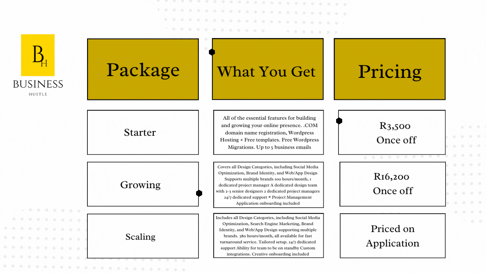

import Bleed from 'nextra-theme-docs/bleed'

# Save time & work more efficiently with your team remotely

<Bleed></Bleed>

This all new project management app helps you, your team members or employees to communicate effectively with one another and make sure all relevant information gets through. And it's simple: just install the app on each member's phone or computer, then create a project. Your team can then use the app to communicate with one another about that project, or they can simply share files directly from within the app itself!

We want to help you manage risk better, communicate more effectively, work less, and radically increase your team's productivity. [Click here to start your free trial today!](https://bit.ly/BH-App)

## Why do I need this?

Don’t let valuable information get lost in the sea of other content in your business.

The importance of internal communication within organizations is very misunderstood. Too much irrelevant content often results in information silos. Meaning, information that is actually important to an employee/team member can easily get lost.

We are here to help you solve this problem and radically increase your team's productivity with our new project management app by Business Hustle.

<Bleed></Bleed>

## Digital transformation 

We offer full-stack solutions to companies and organisations, developers and tech lovers. Businesses are steadily adopting to approaches that are more inclusive to the People, Planet, and Profit in business strategies. Meanwhile, technology is responsible for  generating sustainable and accountable business models.

<Bleed></Bleed>

## Our unique approach 

<Bleed></Bleed>

## Our pricing 

<Bleed></Bleed>

